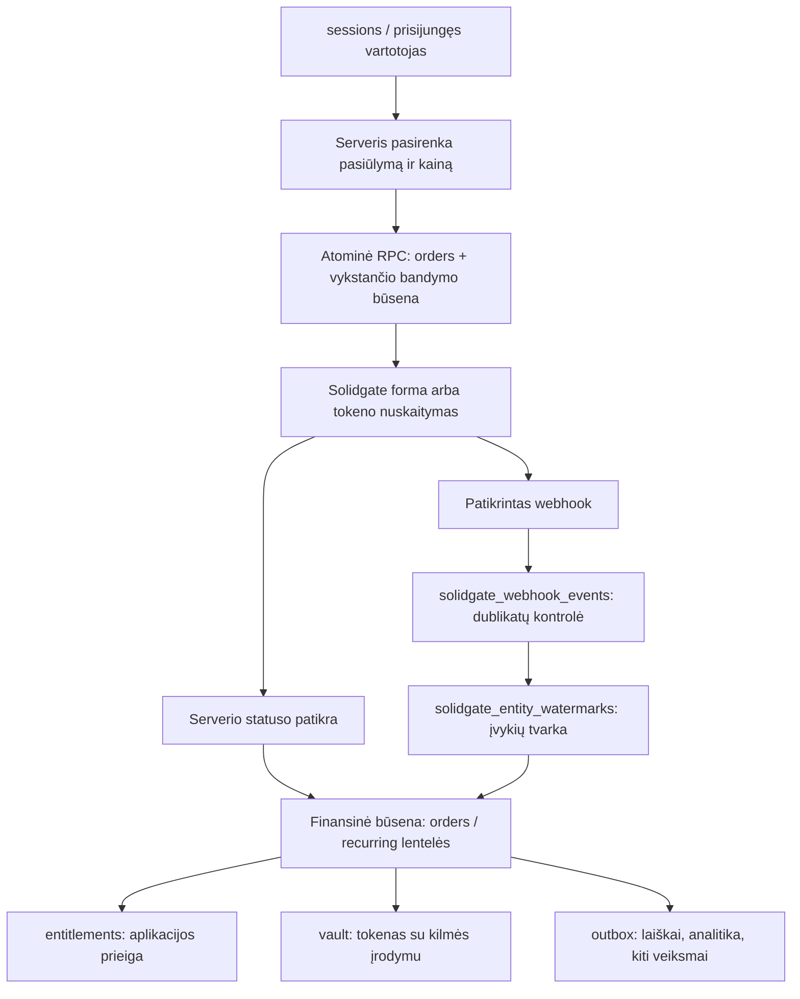

# Solidgate: dabartinė architektūra ir naujo boilerplate ribos

Patikrinta 2026-09-09 pagal šio darbo katalogo kodą ir migracijas, įskaitant necommitintus rugsėjo pakeitimus. Tai statinė kodo ir schemos peržiūra; produkcinės DB schema, duomenų apimtys, užklausų planai ir Solidgate paskyros nustatymai netikrinti. Analizės metu schema, mokėjimų kodas ir išorinės sistemos nekeisti. Mokamų API operacijų neatlikta.

Žodynuose aprašytos **22 lentelės ir 307 stulpeliai**: 15 aktyvių mokėjimų lentelių, 4 gretimos platformos / analitikos lentelės ir 3 Stripe palikimo lentelės. Kiekvienam stulpeliui pateiktas tipas, NULL / default, paskirtis ir naudojimo kontekstas; lentelėms — raktai, ribojimai ir perkėlimo rekomendacija. Stulpelių sąrašai papildomai sutikrinti su generuotais DB tipais; du realūs tipų praleidimai aprašyti žemiau.

## Vertinimas

**Tai geras sudėtingos veikiančios integracijos pagrindas, bet dar nėra švarus bendras mokėjimų modulis.** Stiprioji dalis — nekintanti mokėjimo tapatybė, apsauga nuo lygiagrečių nuskaitymų, pakartojimų ir pavėlavusių webhook įvykių. Silpnoji — mokėjimo, prenumeratos, verslo pasiūlymo, autentifikacijos ir konkretaus produkto veiksmų susipynimas.

Nerekomenduoju perkelti viso `supabase/migrations` katalogo į tuščią boilerplate. Jame yra Stripe istorija, šiam produktui pritaikyti duomenų taisymai, perėjimo laikotarpio funkcijos, astrologijos lentelės ir kainos. Naujai DB reikia vienos konsoliduotos pradinės mokėjimų schemos ir atskirų pasirenkamų funkcijų migracijų. Esamam projektui istorinių migracijų perrašyti nereikia.

Optimizacija čia pirmiausia reiškia aiškesnes atsakomybes ir mažiau vietų, kurias reikia keisti keičiant produktą. Be DB matavimų negalima pagrįstai teigti, kad dabartinė sistema lėta arba kad sumažinus lentelių skaičių ji paspartės.

## Priimtas sprendimas: boilerplate naudoja v1

**Boilerplate kuriame su API v1 / Billing 1.0.** Vartotojas perdavė tiesioginę Solidgate rekomendaciją dabar naudoti v1, o v2 naujoves atskirai išbandyti sandbox aplinkoje. Ši konkrečiam projektui pateikta rekomendacija nustato mūsų įgyvendinimo kryptį. Dabartinis klientas jau naudoja v1: `packages/shared/src/solidgate/client.ts:15`, `catalog.ts:472`.

V2 lieka atskiras būsimas sandbox tyrimas; jis nėra boilerplate paleidimo sąlyga. Solidgate pasiūlytas v2 sandbox dar nėra užsakytas ar sukonfigūruotas. Viešos dokumentacijos bendroji Billing 2.0 rekomendacija lieka informaciniu kontekstu, o ne šio projekto sprendimu. [Oficialus Billing palyginimas](https://docs.solidgate.com/billing/overview/).

Rekomendacija atskirti klientą, pirkimą, mokėjimo bandymą, prenumeratą ir sąskaitą galioja ir v1 moduliui. Tai mūsų vietinės DB atsakomybės, o ne reikalavimas naudoti v2 providerio objektus. Kuriame aiškų v1 adapterį; bendro dviejų API versijų palaikymo dabar nereikia.

Nepainioti API versijos su įvykio pavadinimu: dabartinis `subscription.updated.v2` dar savaime nereiškia Billing 2.0 integracijos. Billing 2.0 skiriasi ir webhook struktūra bei parašo tikrinimu. [Webhook dokumentacija](https://docs.solidgate.com/payments/integrate/webhooks/).

## Kaip suprasti dabartinį duomenų modelį

| Sąvoka | Ką reiškia | Kur dabar gyvena |
|---|---|---|
| Produktas / pasiūlymas | Ką parduodame ir kokiomis sąlygomis | `price-map.ts`, `solidgate/catalog.ts`, providerio katalogas, dalis SQL funkcijų |
| Sesija | Anoniminio funnel lankytojo ir jo progreso kontekstas | `sessions` |
| Užsakymas | Konkretus pradinio arba papildomo pirkimo bandymas ir jo suvestinė | `orders` |
| Mokėjimo bandymas | Vienas konkretus veiksmas su nekintančiu providerio `order_id` | `orders` ir checkout state lentelės |
| Prenumerata | Ilgalaikis periodinio apmokėjimo susitarimas | Solidgate; lokaliai jos būsena išskirstyta po `orders`, `entitlements`, recurring lenteles |
| Sąskaita | Vieno prenumeratos laikotarpio apmokėjimas | `solidgate_invoice_orders`, `renewal_events` |
| Prieigos teisė | Ką vartotojas gali naudoti aplikacijoje | `entitlements` |
| Išsaugotas mokėjimo būdas | Providerio tokenas vėlesniam nuskaitymui | Dvi `*_vault` lentelės |
| Inbox | Gautas providerio įvykis ir jo apdorojimo būsena | `solidgate_webhook_events` |
| Outbox | Po finansinio pakeitimo patikimai atliktinas papildomas veiksmas | `solidgate_fulfillment_outbox`, `solidgate_analytics_outbox` |

`orders.id` yra mūsų DB UUID. `solidgate_order_id` yra merchant sukurtas mokėjimo ID. `solidgate_subscription_id` identifikuoja prenumeratą. `solidgate_invoice_id` identifikuoja vieną jos sąskaitą. Jie sprendžia skirtingus uždavinius ir neturi būti sutraukti į vieną `payment_id`.

**Pavyzdys:** pagal dabartinį EUR katalogą `trial1` pradinis mokestis yra 5 EUR, o po 7 dienų numatytas 59 EUR apmokėjimas kas 30 dienų. Pirmas pirkimas atsiranda `orders`. Prenumeratos ID suriša jį su vėlesniais apmokėjimais. Vėlesnė sąskaita registruojama recurring modelyje; ji nėra dar vienas to paties 5 EUR checkout patvirtinimas. `entitlements` atsako, ar klientas gali naudotis produktu. Pasikartojęs webhook neturi dar kartą pridėti pajamų ar išsiųsti tos pačios paslaugos.

## Dabartinis srautas



Diagrama rodo atsakomybes ir duomenų srautą, ne pažadą, kad visi parodyti rašymai jau sudėti į vieną DB transakciją. Dabartinis webhook dalį darbo atlieka keliais DB kvietimais; pakartojimo saugumas priklauso nuo konkrečių RPC, unikalių raktų ir būsenų apsaugų.

1. Serveris pagal sesiją / vartotoją pasirenka kainą, valiutą ir produkto ID. Browser pateikta suma nėra patikimas kainos šaltinis.
2. Atominė DB funkcija atidaro arba grąžina jau vykstantį bandymą. Lygiagretūs kvietimai gauna tą patį `order_id`; tik vienas gauna teisę kurti formą ar siųsti nuskaitymą.
3. Mokėjimo forma renka kortelės duomenis Solidgate pusėje. Išsaugotos kortelės srautas naudoja providerio tokeną.
4. Gavus timeout, nežinoma, ar nuskaitymas įvyko. Todėl tikrinamas tas pats bandymas; naujas ID kuriamas tik turint patikimą galutinės nesėkmės įrodymą.
5. Browser sėkmės callback nėra mokėjimo įrodymas. Jį patvirtina serverio statuso tikrinimas arba patikrintas webhook.
6. Pinigų būsena projektuojama į prieigą. Grąžinimas ar ginčas turi blokuoti senos sėkmės pakartotinį prieigos suteikimą.
7. Papildomi veiksmai patikimai kartojami per outbox.

Solidgate dokumentacija patvirtina, kad webhook gali kartotis ir atkeliauti ne eilės tvarka. Vadinasi, inbox ir būsenų eiliškumo apsauga yra reikalinga infrastruktūra. [Oficiali įvykių apdorojimo dokumentacija](https://docs.solidgate.com/payments/integrate/webhooks/).

## Kurios lentelės reikalingos

Tai dabartinių lentelių funkcijų klasifikacija, o ne pažodinis naujos schemos DDL.

| Dabartinė lentelė | Paskirtis | Sprendimas naujam boilerplate |
|---|---|---|
| `orders` | Pirkimai, bandymai, pradinė finansinė ir dalis prenumeratos būsenos | Būtina funkcija; išskaidyti atsakomybes |
| `entitlements` | Produkto prieigos teisės | Būtina prieigos kontrolę turintiems produktams |
| `renewal_events` | Prenumeratos sąskaitų finansinė suvestinė | Funkciją išlaikyti; siūloma bendresnė `invoices` |
| `solidgate_invoice_orders` | Providerio sąskaitos ir mokėjimo order ryšys | Išlaikyti adapteryje arba modeliuoti per sąskaitą ir jos bandymus |
| `solidgate_webhook_events` | Gautų įvykių patikimas registras | Būtina `webhook_inbox` funkcija |
| `solidgate_entity_watermarks` | Vieno objekto įvykių eiliškumas ir užraktas | Būtina funkcija; atskira lentelė arba domeno objektų versijų kontrolė |
| `solidgate_fulfillment_outbox` | Patikimi veiksmai po pirkimo | Išlaikyti bendrą outbox infrastruktūrą |
| `solidgate_analytics_outbox` | PostHog įvykių pristatymas | Analitika pasirenkama; galima bendra jobs infrastruktūra su atskiru vykdytoju |
| `solidgate_main_checkout_states` | Funnel checkout formos bandymo būsena | Perkelti į bendrą `payment_attempts` modelį |
| `solidgate_pwa_purchase_states` | Prisijungusio pirkėjo bandymas, forma, tokenas, 3DS | Perkelti į tą patį modelį, išlaikyti skirtingą autorizaciją |
| `solidgate_session_vault` | Anoniminio funnel tokenas | Reikia, jei yra anoniminis checkout ir one-click upsell |
| `solidgate_account_vault` | Paskyros tokenas | Reikia, jei naudojami išsaugoti mokėjimo būdai |
| `solidgate_intro_claims` | Vienkartinio įvadinio pasiūlymo panaudojimas | Pasirenkama pagal pasiūlymo politiką |
| `solidgate_card_update_attempts` | Kortelės pakeitimo / patikrinimo procesas | Pasirenkama funkcija; nėra produkto pirkimas |
| `solidgate_subscription_token_sync_jobs` | Naujo tokeno perdavimas esamoms prenumeratoms | Išlaikyti v1 modulyje, jei palaikomas kortelės keitimas |
| `sessions` | Quiz ir funnel būsena | Bendros platformos dalis; mokėjimai turi tik nuorodą |
| `user_acquisition_attribution` | Pirmojo įsigijimo UTM | Analitikos modulis |
| `meta_capi_event_claims` | Meta siuntimų pasikartojimo apsauga | Marketingo modulis |
| `funnel_events` | Funnel žingsnių analitika | Analitikos modulis |
| `payment_intent_sessions` | Stripe PaymentIntent–sesijos ryšys | Naujam Solidgate-only projektui nekelti |
| `stripe_customers` | Senas Stripe / perėjimo laikotarpio klientų vault | Naujam Solidgate-only projektui nekelti |
| `stripe_webhook_events` | Stripe webhook dublikatų apsauga | Naujam Solidgate-only projektui nekelti |

`otp_attempts`, `deletion_requests`, `auth.users` ir turinio lentelės priklauso autentifikacijai, paskyros valdymui ar produktui. Jos nėra Solidgate modulio lentelės. Mokėjimų adapteris gali naudotis jų paslaugomis, bet neturi jų valdyti kaip savo schemos.

## Svarbiausi radiniai prieš pakartotinį naudojimą

### 1. Kritinis: mokėjimas nėra el. pašto nuosavybės įrodymas

`linkAuthUser()` administratoriaus teisėmis sugeneruoja magic link ir iškart sunaudoja jo tokeną dabartinio browser sesijoje (`apps/funnel/src/lib/payment/provision-account.ts:61`). Tai daroma ir kai vartotojas jau egzistuoja. `grant/route.ts:1444` kviečia šį kelią su checkout el. paštu.

Pagal kodą pirkėjas gali būti prijungtas prie esamos paskyros neįrodęs, kad valdo jos paštą, jei kitos pirkimo sąlygos leidžia checkout. Tai statinis saugumo radinys; realus užgrobimas nebuvo vykdomas. Naujame modulyje mokėjimo priskyrimas ir prisijungimas turi būti atskiri veiksmai. Esamai paskyrai reikia jau patvirtinto vartotojo arba pašto patvirtinimo.

### 2. Aukštas: bendros mokamos prieigos tikrinimas per daug atviras

`packages/shared/src/entitlements.ts:174` DB klaidos atveju grąžina `active`; kai teisės nėra arba ji pasibaigusi be aiškaus atšaukimo žymens — `none`. PWA layout blokuoja tik `revoked` (`apps/pwa/src/app/[locale]/(app)/layout.tsx:44`). Tai sąmoningai pasirinkta esamo produkto politika, bet netinka kaip bendras „turi aktyvią mokamą prieigą“ kontraktas.

Reikia atskirti `active`, aiškiai apibrėžtą ribotos trukmės `grace`, `pending`, `denied` ir techninę klaidą. Kiekvienas mokamas API / turinio srautas taip pat turi tikrinti teises. Layout patikra savaime neįrodo visų API apsaugos; visa API autorizacija šio audito metu nebuvo tikrinta.

### 3. Aukštas: finansinė istorija priklauso nuo funnel sesijos gyvavimo

`orders.session_id` turi `ON DELETE CASCADE` (`supabase/migrations/00001_initial.sql:98`). Ištrynus sesiją gali būti ištrintas užsakymas, o tolesni susiję įrašai gali būti pašalinti arba ištrynimas užblokuotas kitų apribojimų. Tai netinkama numatytoji riba bendram finansiniam registrui.

Naujai schemai rinktis aiškią saugojimo politiką: paprastai nullable sesijos nuoroda su `SET NULL` arba `RESTRICT`, finansinė tapatybė saugoma nepriklausomai. Čia nenustatomas teisinis saugojimo terminas ir nepatvirtinama, kad istorija jau buvo prarasta.

### 4. Aukštas: įvadinio pasiūlymo dublikatai registruojami, bet automatiškai neišsprendžiami

Dabartinis intro srautas gali perleisti neapmokėtą claim kitai sesijai iškart. Ankstesnė mokėjimo forma dėl to nebūtinai tampa nebemokėtina. Jei abu mokėjimai pavyksta, `superseded_subscription_ids` ir `solidgate_intro_claims_needing_refund` parodo, kad reikia grąžinimo. Pilno šios eilės sprendimo worker nerasta.

Tai nėra garantija „viena įvadinė prenumerata vartotojui“. Naujame modulyje reikia pasirinkti leidžiamą pakartotinio checkout politiką ir turėti patikimą kompensavimo procesą, kuriame matytųsi atliktas grąžinimas / atšaukimas, klaida, bandymų skaičius ir rezultatas.

### 5. Aukštas: patikimo apdorojimo garantijos dar ne visur pilnos

Webhook suteikia teisę, vėliau atskirais DB kvietimais įrašo papildomus darbus ir užbaigia inbox (`supabase/functions/solidgate-webhooks/index.ts:2963`, `:2993`, `:4680`). Proceso nutrūkimas tarp šių veiksmų palieka tarpą, kurį gali sutvarkyti pakartotinis įvykis, bet tai nėra transakcinio outbox garantija. Reikia vienos domeno pakeitimo ir outbox įrašymo transakcijos.

Taip pat nerastas savarankiškas worker, periodiškai iš `solidgate_webhook_events.payload` pakartotinai apdorojantis failed / užstrigusius įvykius. Dabartinis atkūrimas priklauso nuo naujo providerio HTTP pristatymo. Patvariai išsaugotas payload savaime dar nereiškia veikiančio atkūrimo.

Entity lease naudoja `processing_event_id`, bet neturi konkretaus vykdytojo tokeno. Perėmus tą patį įvykį po lease pabaigos, senas worker gali užbaigti / paleisti naujajam priklausančią lease. `SELECT FOR UPDATE` apsaugo trumpą claim RPC transakciją, ne visą vėliau vykdomą TypeScript handlerį. Tai statinis galimo konkurencijos scenarijaus radinys; produkcinis incidentas nepatvirtintas. Naujam moduliui reikia ir domeno rašymų apsaugos konkrečiu claim arba trumpos atominės domeno transakcijos.

### 6. Vidutinis: analitikos outbox apsaugotas silpniau nei fulfillment

`solidgate_analytics_outbox` completion / failure rašymai filtruoja tik aplinką ir įrašo ID (`supabase/functions/solidgate-webhooks/index.ts:820`, `:847`), neturi konkretaus claim token patikros. Pasibaigus lease senas worker gali perrašyti naujesnio worker būseną. Pastovus analitikos įvykio ID sumažina dubliavimą išorinėje sistemoje, bet nepakeičia DB claim apsaugos.

Analitikos siuntimas taip pat vykdomas webhook atsakymo kelyje (`:4669`, `:4688`), o atskiras fulfillment endpoint vykdo fulfillment ir token-sync, ne šį analytics drain. Siūloma bendra patikimų darbų infrastruktūra: `claim_token`, užrakinimas, backoff, savarankiškas suplanuotas worker ir užstrigusių darbų stebėjimas. Providerio webhook atsakymas neturėtų priklausyti nuo PostHog pasiekiamumo po to, kai jo įvykis saugiai priimtas ir jam suplanuotas darbas.

### 7. Vidutinis: kainos ir produktų taisyklės kartojamos keliose vietose

Sumos yra `price-map.ts`, `solidgate/catalog.ts` ir SQL `solidgate_main_checkout_amount()` (`supabase/migrations/20260908110000_wave2_currency_amounts.sql:20`). SQL taip pat turi konkrečių pasiūlymų / OTO žingsnių taisyklių. Saugumo tikrinimas DB reikalingas, tačiau rankinis tų pačių kainų redagavimas keliose vietose apsunkina kitų produktų paleidimą.

Siūlomas vienas autoritetingas pasiūlymų manifestas, iš kurio generuojamos versijuotos kainos DB / seed duomenys ir UI kontraktas. DB opener gauna pasiūlymo kainos versijos ID ir serverio pusėje nuskaito patvirtintą kainą. Atidarytame bandyme išlieka jos snapshot; kainos pakeitimas neturi perrašyti jau vykstančio mokėjimo.

`scripts/solidgate-seed-catalog.ts:149` dabartinis `--verify` tikrina kainas ir jų ID, tačiau neįrodo viso produkto billing / trial / payment action kontrakto. Naujam paleidimui reikalingas ir pilnų produkto savybių patikrinimas. Jo šiame audite nevykdėme.

### 8. Vidutinis: locale nustatymas gali tyliai pakeisti kainos kontekstą

`create-session/route.ts:347` nenustačius `ENABLED_CHECKOUT_LOCALES` remiasi `en`, o neįjungtai naujo checkout kalbai gali parinkti anglų kalbos kainodarą. Bendrame modulyje trūkstama konfigūracija turi sukelti aiškią klaidą arba naudoti vieną visur rodomą patvirtintą quote. Vartotojo matoma suma ir serverio snapshot turi sutapti.

### 9. Vidutinis: DB tipai ir dokumentacija nėra pilnai sinchronizuoti

`solidgate_invoice_orders` migracijoje turi `product_price_id` ir `order_metadata`; webhook juos rašo, tačiau `packages/shared/src/types/database.ts` lentelės apraše jų nėra. RPC naudojami ir rankiniai `as unknown as` adapteriai. Boilerplate reikia tipų generavimo iš švariai pritaikytos schemos bei CI patikros, kad commitinti tipai atitinka migracijas.

Senas `IMPLEMENTATION_AND_MIGRATION_GUIDE.md` remiasi liepos 24 d. būsena. Pavyzdžiui, dabartiniame kode jau yra PWA prenumeratos atšaukimas (`subscription/cancel/route.ts`), ribojamas angliškam support srautui; `special_free` ir advisory intro kataloge jau mokami. Istorinis dokumentas tinka kontekstui, bet nėra dabartinės būsenos šaltinis.

### 10. Vidutinis: pajamų suvestinės sumuojamos aplikacijoje

`apps/funnel/src/app/admin/_queries/revenue.ts:24` ir `:41` parsisiunčia atitinkamas order / renewal eilutes, o sumos apskaičiuojamos TypeScript. Šiose užklausose nėra puslapiavimo. Jei rezultatas viršija sukonfigūruotą Data API eilučių ribą, suvestinė bus nepilna; reali šio projekto riba ir duomenų kiekis netikrinti. DB `SUM` / grupavimas sumažintų perduodamų duomenų kiekį ir pašalintų šią priklausomybę. Be to, `grossRevenue` pavadinimas klaidina, jei sumuojamos jau refund koreguotos neto sumos.

## Siūloma modulio struktūra

```text
packages/payments/
  domain/                pirkimas, bandymas, prenumerata, teisė, sumos
  application/           openCheckout, confirmPayment, cancelSubscription
  providers/solidgate/   parašai, API, statusų ir įvykių normalizavimas
  persistence/           DB užklausos, atominės RPC, migracijos
  jobs/                  inbox apdorojimas, outbox, reconciliation
  contracts/             produkto konfigūracija ir vieši tipai
  testing/               providerio fixtures ir vietiniai testai

apps/<projektas>/
  payment-config.ts      prekės ženklas, pasiūlymai, kainos, prieigos taisyklės
  payment-handlers.ts    domeno įvykių reakcijos: laiškai, turinys, CRM
  api/...                ploni auth / HTTP adapteriai
```

Mokėjimų paketas neturi importuoti astrologijos, Next.js puslapių, quiz atsakymų ar PostHog kaip būtinos pirkimo priklausomybės. Pvz. `PaymentConfirmed` domeno įvykis gali sukurti „paruošti gimimo profilį“ darbą konkrečiame projekte. Bendras mokėjimų modulis nežino, kas yra gimimo profilis.

Nereikia iš anksto kurti visų įmanomų PSP adapterių. Pakanka aiškių Solidgate ribų ir domeno tipų, kuriuose Stripe istorija nėra numatytoji reikšmė.

## Siūlomas naujos schemos karkasas

Šis sąrašas yra projektavimo pasiūlymas, o ne jau esanti ar paruošta vykdyti migracija. Billing versija pasirinkta — v1. Pilnas kiekvieno naujo stulpelio DDL turi būti priimtas apsibrėžus privalomas funkcijas ir jų v1 kontraktus. `billing_customers`, `subscriptions` ir `invoices` čia reiškia vietinį domeno modelį, ne v2 API naudojimą.

| Siūloma lentelė | Vienos eilutės reikšmė | Svarbiausia riba |
|---|---|---|
| `billing_customers` | Vienas mokėjimų klientas konkrečiame providerio scope | Atskiras nuo auth paskyros; patikimas susiejimas po autentifikacijos |
| `orders` | Vienas verslo pirkimas | Nekintantis įsigyto pasiūlymo snapshot; nesuplakti su prenumeratos gyvavimu |
| `payment_attempts` | Vienas nuskaitymo / checkout bandymas | Nekintantis providerio ID, suma, valiuta, rezultatas, 3DS, claim |
| `subscriptions` | Viena prenumerata | Būsena, kainos versija, laikotarpis, atšaukimo planas, providerio ID |
| `invoices` | Viena pradinė ar periodinė sąskaita | Priežastis `initial` / `renewal` / kita; finansinės sumos atskirai nuo access |
| `entitlements` | Viena teisė naudoti produkto funkciją | Access politika ir mokėjimo / prenumeratos kilmė |
| `webhook_inbox` | Vienas gautas providerio įvykis | Dedupe, versija, kilmė, būsena, claim, klaida |
| `payment_outbox` | Vienas patikimai atliktinas veiksmas | Unikalus efekto raktas, claim, retry, rezultatas |
| `payment_methods` | Vienas kliento išsaugotas mokėjimo būdas | Pasirenkama; providerio instrumentas / tokenas, kilmė ir galiojimas |
| `payment_adjustments` | Vienas grąžinimas ar ginčo finansinis pakeitimas | Reikia pilnam refund / dispute žurnalui; vien suminių laukų nepakanka operacijų istorijai |
| `intro_offer_claims` | Vieno kliento / identiteto vieno pasiūlymo panaudojimas | Pasirenkama; unikalumas turi apimti `offer_key`, ne vien el. paštą |
| `offer_prices` | Viena patvirtinta pasiūlymo kainos versija | Pasirenkama kaip DB katalogas; alternatyva — generuojamas versijuotas manifestas |

Ryšiai turi leisti vienam pirkimui turėti kelis bandymus, prenumeratai — kelias sąskaitas, sąskaitai — kelis mokėjimo bandymus. Vienam paketiniam pirkimui gali reikėti kelių teisių. Jei parduodamas tik vienas produktas vienam pirkimui, pradžioje atskiros `order_items` lentelės nereikia; krepšeliui / kelioms pozicijoms ji tampa prasminga.

Abi dabartinės vault lentelės turi realią priežastį egzistuoti: anoniminis pirkėjas dar neturi auth vartotojo. Jas saugiai sujungti galima tik įvedus stabilų billing customer ir patikimą susiejimą su auth. Vien `user_id nullable` ir laisvai keičiamas session savininkas tokio kontrakto nepakeičia. Kortelės tokeno kilmė taip pat nėra automatiškai tolygi šiandieninei prieigos būsenai: reikia aiškiai nuspręsti, kada grąžintas pirkinys turi panaikinti teisę naudoti konkretų mokėjimo būdą.

## Duomenų bazės taisyklės, kurias būtina išsaugoti

- Pinigai saugomi sveikais mažiausiais valiutos vienetais; naujam modeliui aiškesnis pavadinimas `amount_minor`, nes ne visos valiutos turi centus. Jokio floating point kainoms.
- Atskiri numatyti, surinkti ir grąžinti pinigai. Nekeičiama pradinė pirkimo kaina vien todėl, kad įvyko refund. Dabartinius `amount_cents` semantikos skirtumus tarp lentelių būtina suprasti prieš perkeliant.
- Unikalūs providerio raktai apima aplinką. Jei vienoje DB bus keli projektai / kanalai, papildomai reikia aiškaus merchant/channel/project scope. Jei kiekvienas projektas turi atskirą DB, vien multi-tenant teorija neturi komplikuoti MVP.
- Viena atominė operacija rezervuoja bandymą. Tinkamas unique indeksas + transakcija / užraktas yra svarbiau nei `SELECT` ir po jo atskiras `INSERT` aplikacijoje.
- Lease pasibaigimas savaime nesuteikia teisės pakartoti pinigų nuskaitymo. Pirmiausia reconciliation su tuo pačiu providerio ID.
- Vėluojantis worker gali užbaigti tik jam priklausantį claim. Ta pati taisyklė reikalinga inbox, fulfillment, token sync ir analitikai.
- Providerio įvykių tvarkos kontrolė ir idempotentiški domeno pakeitimai sprendžiami kartu. „Naujesnis timestamp“ vienas pats neapsaugo visų finansinių perėjimų. Skirtingus įvykius su vienodu timestamp dabartinė galutinė logika leidžia apdoroti; `event_id` negalima laikyti chronologine seka.
- Mokėjimo / prieigos pakeitimas ir atitinkamo outbox įrašo sukūrimas turi būti toje pačioje DB transakcijoje. Išorinės API neįmanoma įtraukti į vietinę SQL transakciją; jai reikia pakartojimo ir kompensavimo.
- Finansinės lentelės serverio rašomos; kortelių tokenai, webhook payload ir vidinių darbų turinys neturi būti bendros klientui skaitomos eilutės dalimi.
- RLS riboja eilutes, ne jautrių stulpelių atvaizdavimą. Jei vartotojas gali skaityti savo `orders`, jam skirtą projekciją / DTO reikia suprojektuoti atskirai. Schemai, kuri pasiekiama per Supabase Data API, taikyti ir tinkamas grants, ir RLS. [Supabase RLS dokumentacija](https://supabase.com/docs/guides/database/postgres/row-level-security).

## Indeksai ir eksploatavimas

Dabartiniai unikalūs `(payment_environment, solidgate_order_id)` ir aplinką apimantys kiti providerio raktai yra naudingi. Jobs claim funkcijų indeksai ir `SKIP LOCKED` padeda padalyti darbus tarp worker. Šių apsaugų šalinimas dėl „mažiau lentelių“ būtų regresija.

Naujame modelyje indeksus derinti prie realių užklausų: kliento prenumeratos; užsakymo bandymai; nebaigti inbox / outbox darbai pagal `next_attempt_at`; konkretaus providerio sąskaita. Dalinius indeksus naudoti aktyvioms darbo eilėms. Nedubliuoti kiekvieno stulpelio indeksu be užklausos, kuri jo reikalauja.

Prieš tvirtinant našumo išvadas surinkti lentelių ir indeksų dydžius, realų eilučių skaičių, lėtas užklausas, užraktų laukimą ir reprezentatyvius `EXPLAIN (ANALYZE, BUFFERS)`. Finansinių RPC su šalutiniu poveikiu taip produkcijoje netestuoti — matavimus daryti saugioje reprezentatyvioje aplinkoje.

Reikia numatyti žurnalo saugojimą / archyvavimą, užstrigusių darbų signalus, retry limitus ir operatoriaus reconciliation sąrašą. Bendro visų klaidų retry limito dabar nėra; `manual_review` taikomas tik tam tikriems atvejams. Worker turi atskirti kartotinas ir galutines klaidas. Providerio webhook retry laikotarpis nėra neriboto vietinio recovery pakaitalas. Inbox payload ir outbox gali turėti asmens duomenų; jų saugojimo politiką apibrėžti atskirai nuo ilgalaikės finansinės istorijos. Operaciškai būtini pranešimai apie ginčus taip pat turi būti patvarūs: dabartinis Slack `sendDisputeAlert()` siuntimo klaidą tik užregistruoja loge.

## Dokumentacija kitam projektui ir agentui

Minimalus perduodamas paketas:

1. Modulio ribos ir viešos funkcijos: ką kviečia apps ir ko joms negalima tiesiogiai rašyti į DB.
2. Lentelių ir stulpelių žodynas su raktais, būsenomis, rašytojais ir skaitytojais.
3. Būsenų perėjimai: checkout, auth/capture, 3DS, retry, renewal, dunning, cancel, refund, dispute.
4. API versija ir normalizuotų įvykių kontraktas; providerio payload fixtures.
5. Kainų manifestas: sumos, valiutos, billing period, intro trukmė, payment action, produkto ir price ID kiekvienam scope.
6. Auth susiejimo ir prieigos politika, įskaitant `pending` ir grace.
7. Vietiniai testai, sandbox scenarijai ir paleidimo kriterijai.
8. Operatoriaus instrukcijos: kaip atkurti užstrigusį mokėjimą neinicijuojant antro nuskaitymo, kaip rasti ir išspręsti refund reikalaujantį dublikatą.
9. Kainuojančių išorinių operacijų taisyklė: prieš vykdymą gauti aiškų patvirtinimą ir maksimalų biudžetą; jokie katalogo / testinių mokėjimų skriptai neturi būti paleidžiami automatiškai vien radus raktą.

## Naujo projekto setup seka

Tai būsimo setup kontrakto seka. Ji šiame audite nebuvo vykdoma.

1. Nuspręsti privalomą apimtį: prenumerata, vienkartiniai pirkiniai, anoniminis funnel, one-click, kortelės keitimas, intro ribojimas.
2. Naudoti API v1 / Billing 1.0 ir patikrinti konkretaus merchant / channel reikalingas galimybes. Užfiksuoti providerio scope ir aplinkų atskyrimą.
3. Pridėti mokėjimų paketą, pritaikyti švarią jo schemą naujai DB, sugeneruoti tipus. Atlikti grants / RLS ir vietinius DB testus.
4. Užpildyti vieną produkto manifestą: stabilūs product / offer keys, kainos ir valiutos, periodai, įvadiniai pasiūlymai, prieigos ir atšaukimo taisyklės.
5. Sukonfigūruoti sandbox raktus, grįžimo adresus, webhook secret ir worker autentifikaciją. Jautrūs raktai tik serverio konfigūracijoje.
6. Pagal pasirinktos versijos kontraktą sukurti / susieti providerio produktus ir kainas. Pirmiausia turėti peržiūrimą planą; prieš atskirai kainuojančius išorinius veiksmus — vartotojo patvirtinimas ir cap. Išsaugoti mapping su aplinka ir kanalu, ne tik pliką produktų ID JSON.
7. Read-back būdu sutikrinti visą billing kontraktą, ne vien sumas. Tik tada įjungti konkrečius pasiūlymus UI.
8. Užregistruoti reikiamų tipų webhook, paleisti inbox / outbox / reconciliation worker ir klaidų stebėjimą.
9. Prijungti projekto auth ir entitlement adapterius. El. pašto įvedimas checkout nėra autentifikacija.
10. Patikrinti srautus: pirmas mokėjimas, dvigubas paspaudimas, timeout, 3DS grįžimas, webhook dublikatas ir sena būsena, renewal, nesėkmingas renewal, atšaukimas, refund, dispute, sandbox izoliacija. Pasirenkamoms funkcijoms — intro dublikatas ir kortelės keitimas.
11. Atskira produkcijos konfigūracija, providerio objektų mapping, darbuotojų paleidimas ir būsenų stebėjimas. Tik išlaikius pasirinktus paleidimo kriterijus įjungti checkout.

Vėlesnis v2 sandbox tyrimas būtų atskiras darbas su savo produkto, kliento, prenumeratos ir webhook kontraktais. Jo setup instrukcijos nepriklauso dabartiniam v1 boilerplate paleidimui. [Solidgate Billing 2.0 integracija ateities tyrimui](https://docs.solidgate.com/billing/subscriptions/subscriptions-2.0/integrate-subscriptions/).

## Peržiūros patikrinimai

Atliktas vietinis esamų testų paleidimas: 49 testai iš penkių rinkinių praėjo (`catalog`, `rpc-binding`, `grant-replay`, `session-vault`, `account-vault`). SQL kainų sutikrinimo rinkinys bendroje `jsdom` konfigūracijoje neužsikrovė su `fileURLToPath` klaida; paleidus jį `--environment node`, visi 7 testai praėjo. Taigi 56 atlikti testai praėjo, bet numatytoje konfigūracijoje lieka atskiras testų aplinkos nesuderinamumas.

Tai vienetiniai / kodo kontraktų testai. Jie nepakeičia pilnos migracijų grandinės ir tikrų lygiagrečių DB transakcijų testų iš `supabase/tests/README.md`. Šiame audite SQL integraciniai, browser, tikrų mokėjimų ir produkcijos našumo testai nevykdyti.

Išsamūs dabartinių stulpelių aprašai:

- [Pirkimai, sąskaitos, prieiga, sesijos ir Stripe palikimas](boilerplate-tables-core.lt.md).
- [Checkout koordinavimas, intro pasiūlymai, kortelės ir tokenų sinchronizavimas](boilerplate-tables-workflows.lt.md).
- [Webhook, įvykių eiliškumas ir papildomų darbų eilės](boilerplate-tables-events.lt.md).
