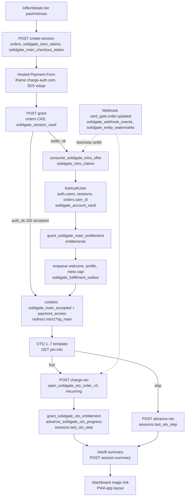

# Kaip viskas veikia: mokėjimų srautai žingsnis po žingsnio

> Šis detalus aprašymas fiksuoja būseną iki 2026-09-14 audito pataisų. Naujas pinigų žurnalas, auth / kortelės patvirtinimo apsaugos ir pakeisti srautai aprašyti [pataisų dokumente](../FIXES_2026-09-14.lt.md).

Šis dokumentas aprašo DABARTINIO boilerplate mokėjimų sistemos srautus nuo pradžios iki galo:
kas vyksta naršyklėje, kurį API route ji kviečia, kurią RPC funkciją ar lentelę tas route
liečia ir kokie apsaugos mechanizmai stovi tarp žingsnių. Kiekvienas teiginys patikrintas
šio repo kode; kur kodas neatsakė, parašyta „nepatikrinta“. Produktų kodai visur yra
placeholder (`BRAND*_000000_*`), kainos netikros, o `catalog-ids.json` tuščias, todėl
realus checkout suveiks tik po katalogo seed'inimo (žr. 10 skyrių).

Nuorodų konvencija: keliai skaičiuojami nuo `docs/solidgate/payments/`, eilučių numeriai
paimti iš realių failų šiame commit'e.

## Žemėlapis

Visi mokėjimams reikšmingi šaltinio failai (sąrašas sudarytas iš `find`, ne iš atminties).
Testų failai (`__tests__`, `*.test.ts`) praleisti.

### Funnel: API route'ai

| Failas | Atsakomybė |
|---|---|
| [api/solidgate/create-session/route.ts](../../../apps/funnel/src/app/api/solidgate/create-session/route.ts) | Atidaro pagrindinį checkout: intro claim, `open_solidgate_main_checkout_v2`, užšifruoja `paymentIntent`, grąžina `merchantData` hosted formai. |
| [api/solidgate/grant/route.ts](../../../apps/funnel/src/app/api/solidgate/grant/route.ts) | Pripažįsta pagrindinį mokėjimą: skaito Solidgate status API, finalizuoja `orders`, rašo vault, cookie'us, kuria paskyrą, suteikia entitlement. |
| [api/solidgate/charge-oto/route.ts](../../../apps/funnel/src/app/api/solidgate/charge-oto/route.ts) | One-click OTO apmokėjimas išsaugota kortele (`/recurring`), 3DS confirm šaka, OTO entitlement ir progreso įrašymas. |
| [api/solidgate/advance-oto/route.ts](../../../apps/funnel/src/app/api/solidgate/advance-oto/route.ts) | „Praleisti“ kelias: `advance_solidgate_oto_progress` be catch-up teisės. |
| [api/solidgate/pm-info/route.ts](../../../apps/funnel/src/app/api/solidgate/pm-info/route.ts) | Grąžina išsaugotos kortelės brand + last4 iš session vault (be PSP kvietimo). |
| [api/orders/session-summary/route.ts](../../../apps/funnel/src/app/api/orders/session-summary/route.ts) | OTO 8 suvestinė: sesijos apmokėti užsakymai, sugrupuoti pagal produkto šeimą. |
| [api/orders/lifetime-poll/route.ts](../../../apps/funnel/src/app/api/orders/lifetime-poll/route.ts) | Success puslapio poll'as, ar webhook įrašė lifetime užsakymą. |
| [api/internal/solidgate-fulfillment/route.ts](../../../apps/funnel/src/app/api/internal/solidgate-fulfillment/route.ts) | Cron / vidinis trigger'is: išsemia fulfillment outbox ir subscription-token sync eilę. |
| [api/meta/capi/route.ts](../../../apps/funnel/src/app/api/meta/capi/route.ts) | Naršyklės inicijuotas Meta CAPI įvykis su `claim_meta_capi_event` dedupe. |
| [api/auth/request-otp/route.ts](../../../apps/funnel/src/app/api/auth/request-otp/route.ts), [verify-otp/route.ts](../../../apps/funnel/src/app/api/auth/verify-otp/route.ts), [claim-purchase/route.ts](../../../apps/funnel/src/app/api/auth/claim-purchase/route.ts), [logout/route.ts](../../../apps/funnel/src/app/api/auth/logout/route.ts) | Ploni wrapper'iai virš `packages/shared/src/auth/*`. |
| [api/session/persist/route.ts](../../../apps/funnel/src/app/api/session/persist/route.ts), [api/session/read/route.ts](../../../apps/funnel/src/app/api/session/read/route.ts) | Anoniminės `sessions` eilutės rašymas/skaitymas; checkout'as ją naudoja atkurti prarastą sesiją. |

### Funnel: lib, proxy, komponentai

| Failas | Atsakomybė |
|---|---|
| [lib/payment/checkout-tiers.ts](../../../apps/funnel/src/lib/payment/checkout-tiers.ts) | Iš katalogo išvestas pagrindinio plano tier'ų žodynas (naudoja proxy, grant, solidgate-access). |
| [lib/payment/funnel-origins.ts](../../../apps/funnel/src/lib/payment/funnel-origins.ts) | Leistini grįžimo origin'ai (`success_url`, OTO return URL) — www/apex ir preview atvejai. |
| [lib/payment/provision-account.ts](../../../apps/funnel/src/lib/payment/provision-account.ts) | `linkAuthUser` (auth user + magic-link prisijungimas), `provisionPurchasedAccount`, `enrichPurchasedAccount`. |
| [lib/payment/solidgate-access.ts](../../../apps/funnel/src/lib/payment/solidgate-access.ts) | `authorizeSolidgateSession`: kas gali naudoti sesijos išsaugotą kortelę (cookie arba paskyra + šaltinio order patikra). |
| [lib/payment/solidgate-fulfillment.ts](../../../apps/funnel/src/lib/payment/solidgate-fulfillment.ts) | Fulfillment outbox worker'is: welcome email, profilio praturtinimas, Meta CAPI, main prenumeratos atšaukimas. |
| [proxy.ts](../../../apps/funnel/src/proxy.ts) | Middleware: i18n, admin allowlist, `/oto/*` cookie + DB patikra, apmokėjusių nukreipimas į PWA. |
| [components/checkout/solidgate-checkout.tsx](../../../apps/funnel/src/components/checkout/solidgate-checkout.tsx) | Hosted Payment Form (`@solidgate/react-sdk`), grant poll'as, terminal/pending būsenos. |
| [features/checkout/components/order-summary.tsx](../../../apps/funnel/src/features/checkout/components/order-summary.tsx) | Užsakymo santrauka checkout modale (tik UI). |
| [features/checkout/lib/catalog-seed.ts](../../../apps/funnel/src/features/checkout/lib/catalog-seed.ts) | Garsi klaida, kai `catalog-ids.json` neseed'intas. |
| [features/offer/components/offer-checkout-modal.tsx](../../../apps/funnel/src/features/offer/components/offer-checkout-modal.tsx) | Montuoja `SolidgateCheckout` tik su `intent={true}` (be auto-mount). |
| [features/offer/components/offer-details-page.tsx](../../../apps/funnel/src/features/offer/components/offer-details-page.tsx) | Tier'o pasirinkimas, `?sg_order` grįžimas po 3DS, `onAccepted`/`onSuccess` → `/oto/1`. |
| [features/offer/components/offer-page.tsx](../../../apps/funnel/src/features/offer/components/offer-page.tsx), [offer-sales-body.tsx](../../../apps/funnel/src/features/offer/components/offer-sales-body.tsx), [offer-sections.tsx](../../../apps/funnel/src/features/offer/components/offer-sections.tsx), [special-offer-email-gate.tsx](../../../apps/funnel/src/features/offer/components/special-offer-email-gate.tsx), [config/offer-data.ts](../../../apps/funnel/src/features/offer/config/offer-data.ts) | `/offer` pardavimo puslapis, kainų picker'is, special-offer el. pašto vartai. |
| [features/oto/config/oto-config.ts](../../../apps/funnel/src/features/oto/config/oto-config.ts) | 7 OTO slotų konfigūracija (produktai, vartai, įvykiai). |
| [features/oto/components/oto-template.tsx](../../../apps/funnel/src/features/oto/components/oto-template.tsx) | Vienas komponentas visiems OTO 1–7: buy/skip, resume po 3DS, main-grant watch. |
| [features/oto/components/oto8-summary-page.tsx](../../../apps/funnel/src/features/oto/components/oto8-summary-page.tsx) | OTO 8 suvestinė ir „accepted“ OTO reconcile sweep. |
| [features/oto/components/accepted-oto-decline-notice.tsx](../../../apps/funnel/src/features/oto/components/accepted-oto-decline-notice.tsx) | Pranešimas, kai anksčiau „accepted“ OTO vėliau buvo atmestas. |
| [features/oto/lib/charge-oto.ts](../../../apps/funnel/src/features/oto/lib/charge-oto.ts) | Kliento `chargeOtoSolidgate` / `resumeSolidgateOto`, `?sg_confirm` tvarkymas. |
| [features/oto/lib/advance-oto.ts](../../../apps/funnel/src/features/oto/lib/advance-oto.ts) | Progreso įrašymas su `keepalive`, kanoninis resume target'as. |
| [features/oto/lib/use-saved-card.ts](../../../apps/funnel/src/features/oto/lib/use-saved-card.ts) | OTO 1 kortelės vartai: ribotas `pm-info` poll'as. |
| [features/oto/lib/use-main-payment-grant.ts](../../../apps/funnel/src/features/oto/lib/use-main-payment-grant.ts) | OTO 1 stebi `?sg_main` — pagrindinio mokėjimo capture. |
| [features/oto/lib/main-payment-recovery.ts](../../../apps/funnel/src/features/oto/lib/main-payment-recovery.ts) | `localStorage` žymė pagrindinio užsakymo atkūrimui po 3DS. |
| [features/oto/lib/use-solidgate-oto-resume.ts](../../../apps/funnel/src/features/oto/lib/use-solidgate-oto-resume.ts) | Užbaigia OTO po 3DS redirect'o (`?sg_confirm`). |
| [features/oto/lib/use-oto-progress-recovery.ts](../../../apps/funnel/src/features/oto/lib/use-oto-progress-recovery.ts) | Pakartoja nepavykusį progreso įrašą kiekviename OTO mount'e. |
| [features/oto/lib/accepted-oto-recovery.ts](../../../apps/funnel/src/features/oto/lib/accepted-oto-recovery.ts), [use-accepted-oto-recovery.ts](../../../apps/funnel/src/features/oto/lib/use-accepted-oto-recovery.ts) | „Accepted“ (202) OTO užsakymų atmintis ir jų reconcile OTO 8 puslapyje. |
| [features/success/components/success-client.tsx](../../../apps/funnel/src/features/success/components/success-client.tsx), [features/auth/components/claim-purchase-prompt.tsx](../../../apps/funnel/src/features/auth/components/claim-purchase-prompt.tsx) | `/success` puslapis ir „pririšti pirkinį prie paskyros“ prompt'as. |
| [app/[locale]/dashboard/page.tsx](../../../apps/funnel/src/app/%5Blocale%5D/dashboard/page.tsx) | Perdavimas į PWA su vienkartiniu magic-link tokenu. |
| [app/admin/_queries/*.ts](../../../apps/funnel/src/app/admin/_queries/) | Admin dashboard užklausos (žr. 10 skyrių). |

### PWA

| Failas | Atsakomybė |
|---|---|
| [api/solidgate/purchase/route.ts](../../../apps/pwa/src/app/api/solidgate/purchase/route.ts) | Narių zonos pirkimas: `open_solidgate_pwa_purchase_v2`, saved-card `/recurring` arba hosted form. |
| [api/solidgate/purchase/confirm/route.ts](../../../apps/pwa/src/app/api/solidgate/purchase/confirm/route.ts) | Pirkimo pripažinimas: status API, `record_solidgate_pwa_confirmed_capture`, `grant_solidgate_pwa_entitlement`, account vault. |
| [api/solidgate/billing/update-card/route.ts](../../../apps/pwa/src/app/api/solidgate/billing/update-card/route.ts) | Kortelės atnaujinimas: nulinės sumos auth, `*_card_update_attempt` RPC, vault, token sync. |
| [api/internal/provision-member-area/route.ts](../../../apps/pwa/src/app/api/internal/provision-member-area/route.ts) | Webhook kviečiamas stub'as pirmam nario paruošimui (no-op). |
| [api/auth/request-otp/route.ts](../../../apps/pwa/src/app/api/auth/request-otp/route.ts), [verify-otp/route.ts](../../../apps/pwa/src/app/api/auth/verify-otp/route.ts), [logout/route.ts](../../../apps/pwa/src/app/api/auth/logout/route.ts), [dev-login/route.ts](../../../apps/pwa/src/app/api/auth/dev-login/route.ts) | OTP prisijungimas PWA pusėje (tie patys shared handler'iai). |
| [api/app-open/route.ts](../../../apps/pwa/src/app/api/app-open/route.ts), [api/user-prefs/route.ts](../../../apps/pwa/src/app/api/user-prefs/route.ts) | App-open skaitiklis (upsell tempui) ir vartotojo nustatymai. |
| [lib/solidgate/checkout.ts](../../../apps/pwa/src/lib/solidgate/checkout.ts) | Kliento `startPurchase` / `confirmPurchase` / `confirmPurchaseAfterRedirect`. |
| [lib/pwa-products.ts](../../../apps/pwa/src/lib/pwa-products.ts) | Ką narių zona gali parduoti (`PWA_SLUGS`, `PWA_SUBSCRIPTION_PRODUCT`). |
| [lib/analytics/payment-event.ts](../../../apps/pwa/src/lib/analytics/payment-event.ts), [acquisition.ts](../../../apps/pwa/src/lib/analytics/acquisition.ts), [posthog.ts](../../../apps/pwa/src/lib/analytics/posthog.ts) | Pirkimo įvykių forma ir UTM paveldėjimas PWA analitikai. |
| [lib/session.ts](../../../apps/pwa/src/lib/session.ts), [lib/record-cron-run.ts](../../../apps/pwa/src/lib/record-cron-run.ts) | Sesijos pagalbininkai; `cron_runs` įrašymas (PWA cron'ų šiame boilerplate nėra). |
| [components/solidgate/SolidgatePaymentForm.tsx](../../../apps/pwa/src/components/solidgate/SolidgatePaymentForm.tsx) | Hosted forma tamsiai narių zonai; po success/fail/error kviečia confirm tik kartą. |
| [components/billing/SolidgatePurchaseReturn.tsx](../../../apps/pwa/src/components/billing/SolidgatePurchaseReturn.tsx) | Užbaigia saved-card 3DS pirkimą po grįžimo su `?sg_confirm`. |
| [components/billing/grace-period-banner.tsx](../../../apps/pwa/src/components/billing/grace-period-banner.tsx), [SubscriptionEndedScreen.tsx](../../../apps/pwa/src/components/billing/SubscriptionEndedScreen.tsx) | Dunning juosta ir „prenumerata baigėsi“ ekranas. |
| [app/[locale]/(app)/layout.tsx](../../../apps/pwa/src/app/%5Blocale%5D/%28app%29/layout.tsx) | Narių zonos vartai: `appAccessEntitlementState`, grace banner, purchase return. |
| [billing/update-payment/_components/SolidgateUpdateCard.tsx](../../../apps/pwa/src/app/%5Blocale%5D/%28app%29/billing/update-payment/_components/SolidgateUpdateCard.tsx) | Kortelės atnaujinimo UI ir `?sg_card_update` grįžimas. |
| [dashboard/_components/shell/ProductPurchaseSheet.tsx](../../../apps/pwa/src/app/%5Blocale%5D/%28app%29/dashboard/_components/shell/ProductPurchaseSheet.tsx) | Pirkimo lapas: kviečia `startPurchase`, montuoja formą, `confirmPurchase`. |

### `packages/shared`

| Failas | Atsakomybė |
|---|---|
| [solidgate/client.ts](../../../packages/shared/src/solidgate/client.ts) | `SolidgateClient` (status, recurring, refund, subscription/*), `getSolidgateKeys`, host'ai, 12 s timeout. |
| [solidgate/form.ts](../../../packages/shared/src/solidgate/form.ts) | AES-256-CBC `paymentIntent` šifravimas ir `merchantData`. |
| [solidgate/signature.ts](../../../packages/shared/src/solidgate/signature.ts) | HMAC-SHA512 parašas API kvietimams ir webhook patikrai. |
| [solidgate/order-id.ts](../../../packages/shared/src/solidgate/order-id.ts) | `order_id` gramatika `{sessionId}:{slug}:{attempt}` — idempotency raktas ir sesijos rišimas. |
| [solidgate/oto.ts](../../../packages/shared/src/solidgate/oto.ts) | `chargeSavedCard` / `subscribeSavedCard`, būsenų klasifikacija, `verify_url` sprendimas. |
| [solidgate/catalog.ts](../../../packages/shared/src/solidgate/catalog.ts) | Produktų kodai, `PRODUCT_ID_TO_CODE`, sumos pagal valiutą, seed'inamų produktų apibrėžimai. |
| [solidgate/catalog-ids.json](../../../packages/shared/src/solidgate/catalog-ids.json) | Solidgate product/price ID (boilerplate'e TUŠČIAS). |
| [solidgate/session-vault.ts](../../../packages/shared/src/solidgate/session-vault.ts) | Sesijos kortelės vault (`solidgate_session_vault`) skaitymas/rašymas per RPC. |
| [solidgate/account-vault.ts](../../../packages/shared/src/solidgate/account-vault.ts) | Paskyros kortelės vault ir sesijos vault promotion į paskyrą. |
| [solidgate/payment-method.ts](../../../packages/shared/src/solidgate/payment-method.ts) | `original_payment_method` → `1-click` / `rebill` (wallet taisyklės). |
| [solidgate/intro-offer.ts](../../../packages/shared/src/solidgate/intro-offer.ts) | Intro claim el. pašto hash ir consume rezultatų semantika. |
| [solidgate/main-accepted-cookie.ts](../../../packages/shared/src/solidgate/main-accepted-cookie.ts) | 10 min `solidgate_main_accepted` cookie (auth_ok įrodymas OTO 1 leidimui). |
| [solidgate/grant-replay.ts](../../../packages/shared/src/solidgate/grant-replay.ts) | Lokali būsena, kuri laimi prieš seną provider `settle_ok` (refund/chargeback/revoke). |
| [solidgate/decline-reason.ts](../../../packages/shared/src/solidgate/decline-reason.ts) | Gateway kodai → pirkėjui rodomi decline raktai. |
| [solidgate/descriptor.ts](../../../packages/shared/src/solidgate/descriptor.ts) | `dynamic_descriptor.suffix` (tik cardholder-present užklausoms). |
| [solidgate/subscription-token-sync.ts](../../../packages/shared/src/solidgate/subscription-token-sync.ts) | Prenumeratos tokeno atnaujinimas Solidgate pusėje per lease'inamą eilę. |
| [solidgate/index.ts](../../../packages/shared/src/solidgate/index.ts) | Re-export'ai. |
| [payment-cookie.ts](../../../packages/shared/src/payment-cookie.ts) | 90 min `payment_access` cookie (HMAC-SHA256). |
| [payment-session-access.ts](../../../packages/shared/src/payment-session-access.ts) | Sesijos mokėjimų skaitymo vartai (OTO 8 suvestinei). |
| [payment-environment.ts](../../../packages/shared/src/payment-environment.ts) | `production` tik Vercel Production; kitur `sandbox`. |
| [entitlements.ts](../../../packages/shared/src/entitlements.ts) | `upsertEntitlement`, `hasEntitlement`, `appAccessEntitlementState`. |
| [grace-period.ts](../../../packages/shared/src/grace-period.ts) | Aktyvi `past_due+grace` prenumerata banner'iui (add-on'ai išskirti). |
| [price-map.ts](../../../packages/shared/src/price-map.ts) | Serverio kainų autoritetas pagal (productId, locale); `PRICE_BATCH`. |
| [oto-product-label.ts](../../../packages/shared/src/oto-product-label.ts) | `orders.product_slug` → stabilus `ProductKey` suvestinei. |
| [locale-prefixes.ts](../../../packages/shared/src/locale-prefixes.ts) | `solidgateOrderDescription` (data-team gramatika `{PREFIX}_{code}`). |
| [format-price.ts](../../../packages/shared/src/format-price.ts), [boilerplate-brand.ts](../../../packages/shared/src/boilerplate-brand.ts) | Kainų formatavimas; brand pavadinimas Apple Pay ir el. laiškams. |
| [auth/request-otp.ts](../../../packages/shared/src/auth/request-otp.ts), [verify-otp.ts](../../../packages/shared/src/auth/verify-otp.ts), [claim-purchase.ts](../../../packages/shared/src/auth/claim-purchase.ts), [entitlement-backfill.ts](../../../packages/shared/src/auth/entitlement-backfill.ts), [otp-rate-limit.ts](../../../packages/shared/src/auth/otp-rate-limit.ts), [post-login-route.ts](../../../packages/shared/src/auth/post-login-route.ts), [logout.ts](../../../packages/shared/src/auth/logout.ts) | OTP prisijungimas, pirkinio pririšimas, entitlement backfill, kur nukreipti po login. |
| [email/send-welcome-email.ts](../../../packages/shared/src/email/send-welcome-email.ts) | Welcome laiškas (naudoja request-otp self-heal ir fulfillment worker'is). |

### Webhook (Supabase Edge Function) ir DB

| Failas | Atsakomybė |
|---|---|
| [solidgate-webhooks/index.ts](../../../supabase/functions/solidgate-webhooks/index.ts) | Visa webhook logika: parašas, inbox, entity ordering, order/subscription/chargeback handler'iai, outbox'ai. |
| [solidgate-webhooks/_signature.ts](../../../supabase/functions/solidgate-webhooks/_signature.ts) | Webhook parašo patikra (wh_* raktai, RAW body). |
| [solidgate-webhooks/_codes.ts](../../../supabase/functions/solidgate-webhooks/_codes.ts) | Produktų katalogas webhook'ui (brand guard). |
| [solidgate-webhooks/_welcome_email.ts](../../../supabase/functions/solidgate-webhooks/_welcome_email.ts) | Welcome laiško turinys Deno pusėje. |
| [supabase/migrations/00001_baseline.sql](../../../supabase/migrations/00001_baseline.sql) | Visa schema: lentelės, trigger'iai, RPC, `solidgate_main_checkout_amount()`. |
| [supabase/tests/*.sql](../../../supabase/tests/README.md) | Vienintelė PL/pgSQL pinigų logikos testų aprėptis. |

### Skriptai

| Failas | Atsakomybė |
|---|---|
| [scripts/solidgate-seed-catalog.ts](../../../scripts/solidgate-seed-catalog.ts) | Sukuria/sutikrina Solidgate produktus ir kainas, generuoja `catalog-ids.json`. |
| [scripts/solidgate-archive-catalog-product.ts](../../../scripts/solidgate-archive-catalog-product.ts) | Archyvuoja katalogo produktą pagal `catalog_key` (prieš keičiant kainą/trial). |
| [scripts/solidgate-reconcile-payment-identities.ts](../../../scripts/solidgate-reconcile-payment-identities.ts) | Legacy `orders` eilučių identiteto surišimas pagal provider įrodymus. |
| [scripts/solidgate-reconciliation-evidence.ts](../../../scripts/solidgate-reconciliation-evidence.ts) | Provider status → įrodymų normalizavimas (naudoja aukščiau esantis skriptas). |
| [scripts/export-price-table.ts](../../../scripts/export-price-table.ts), [export-price-pivot.ts](../../../scripts/export-price-pivot.ts) | `PRICE_MAP` eksportas į CSV/markdown. |

## Diagrama: pagrindinis kelias

## 1. Pagrindinis checkout funnel'yje

Kelias: `/offer` → `/offer/details` (tier'o pasirinkimas) → hosted forma → `grant` → `/oto/1`.

1. **Tier'o pasirinkimas.** [`offer-details-page.tsx`](../../../apps/funnel/src/features/offer/components/offer-details-page.tsx#L74) skaito `?tier=` ir `?sg_order` (L74–L99), o [`offer-checkout-modal.tsx`](../../../apps/funnel/src/features/offer/components/offer-checkout-modal.tsx#L275) montuoja `SolidgateCheckout` su `intent={true}` (L283): vien apsilankymas puslapyje niekada nesukuria mokėjimo intent'o (L36–L38).
2. **Intent'o užklausa.** [`solidgate-checkout.tsx` `openOrder`](../../../apps/funnel/src/components/checkout/solidgate-checkout.tsx#L579) POST'ina `/api/solidgate/create-session` (L588) su `productId`, `sessionId`, UTM ir atribucija. Jei atsakymas 404 (dingusi `sessions` eilutė), vieną kartą atkuria sesiją per `/api/session/persist` ir bando dar kartą (L617–L640).
3. **Tier'o ir sesijos patikra serveryje.** [`create-session/route.ts`](../../../apps/funnel/src/app/api/solidgate/create-session/route.ts#L261) priima tik `CHECKOUT_TIERS` (L53–L60; `trial_monthly` niekada neparduodamas tiesiogiai), skaito `sessions.locale, email, user_id` (L275–L279), tada kviečia [`get_solidgate_main_checkout_identity`](../../../supabase/migrations/00001_baseline.sql#L2933) (L288–L295). Jei egzistuojantis checkout surištas su kitu tier'u — 409 (L316–L321).
4. **Nekintamas identiteto snapshot.** Pakartotiniam bandymui el. paštas, locale, suma, valiuta, `solidgate_product_id` ir `payment_action` imami iš esamo `orders` snapshot'o, ne iš dabartinės sesijos (L323–L336, L432–L478): sesijos redagavimas 3DS metu negali pakeisti provider kliento ar kainos. Locale (taigi ir valiuta) ateina tik iš DB; jei locale nėra `ENABLED_CHECKOUT_LOCALES`, krenta į `en` (L338–L358).
5. **Vieno intro pasiūlymo taisyklė.** Pagal el. paštą per [`find_auth_user_id_by_email`](../../../supabase/migrations/00001_baseline.sql#L9187) surandamas auth user ir tikrinama, ar jis jau turi main plano `entitlements` eilutę (L374–L409). Skaitymo klaida = 503, ne praleidimas („fail closed“, nes po šio taško pinigai gali judėti, L372–L373). Tada [`claim_solidgate_intro_offer`](../../../supabase/migrations/00001_baseline.sql#L8841) atomiškai rezervuoja claim'ą `solidgate_intro_claims` lentelėje pagal SHA-256 el. pašto hash (L484–L531): `already_used` → 409 `INTRO_OFFER_ALREADY_USED`, `in_progress` → 409 `INTRO_OFFER_IN_PROGRESS`.
6. **Katalogo patikra.** `catalog-ids.json` turi turėti `product_id` ir `prices[currency]` (L438–L452); kitaip 500 „catalog not seeded“. Boilerplate'e failas tuščias — tai numatyta, o ne klaida.
7. **Užsakymo atidarymas DB.** [`open_solidgate_main_checkout_v2`](../../../supabase/migrations/00001_baseline.sql#L3391) (route L565–L617) su `p_builder_token` sukuria arba grąžina `orders` eilutę (`status='pending'`) ir `solidgate_main_checkout_states` būseną. RPC viduje: transakcijos advisory lock pagal `environment:session:product_slug` (SQL L3467–L3472), esamos būsenos snapshot palyginimas (L3492–L3514; neatitikimas = `23514`), builder lease 30 s (L3516–L3531). `orders` INSERT'ą tikrina trigger'is [`guard_solidgate_main_payable_order`](../../../supabase/migrations/00001_baseline.sql#L1476): suma privalo sutapti su [`solidgate_main_checkout_amount(p_offer_slug, p_currency)`](../../../supabase/migrations/00001_baseline.sql#L186) — tai serverio kainos autoritetas; neatitikimas meta `SQLSTATE 23514` „invalid Solidgate main original amount“ (L1531–L1544). Route pusėje `reservationMismatch` (L125–L199) dar kartą sutikrina visą grąžintą binding'ą.
8. **Laukimas, jei kitas request'as jau šifruoja.** Jei `merchant_data` dar nėra ir `should_build=false`, route poll'ina iki 40×25 ms (L100–L101, L623–L635) — vietoj antros hosted form sesijos tam pačiam užsakymui.
9. **`paymentIntent` šifravimas.** [`buildFormMerchantData`](../../../packages/shared/src/solidgate/form.ts#L70) (route L652–L711): intent JSON užšifruojamas AES-256-CBC su pirmais 32 secret key simboliais, IV+ciphertext base64 su `+`→`-`, `/`→`_` (form.ts L1–L14, L42–L63), o `signature` yra HMAC-SHA512 virš ŠIFRUOTOS eilutės ([signature.ts](../../../packages/shared/src/solidgate/signature.ts#L30)). Intent'e: `order_id` (gramatika `{sessionId}:{tier}:{attempt}`, [order-id.ts](../../../packages/shared/src/solidgate/order-id.ts#L9)), `product_id` + `product_price_id` (prenumeratos produktas nustato billing periodą ir trial'ą, L666–L669), `customer_account_id = sessionId` (L670–L672), `dynamic_descriptor` suffix'as (L658–L660), `force3ds` tik el. paštui su `+3ds@` (L673–L678), `success_url` su `?sg_order=` į TĄ PATĮ puslapį, kuris pardavė (L686–L702), ir SĄMONINGAI be `fail_url` (L703–L707: su juo atmesta kortelė nukreiptų iframe'ą į mūsų puslapį 320 px rėmelyje). `order_metadata` ribojama 10 raktų / 380 simb. (L540–L556).
10. **Finalizavimas DB.** [`finalize_solidgate_main_checkout_v2`](../../../supabase/migrations/00001_baseline.sql#L3813) (route L717–L746) su tuo pačiu `builder_token` įrašo `merchant_data` į `solidgate_main_checkout_states`; jei identitetas pasikeitė nuo atidarymo — `23514` (SQL L3845–L3852). Route palygina grąžintą `merchant_data` su tuo, ką pats sugeneravo (L738–L746).
11. **Hosted forma.** [`SolidgateCheckout`](../../../apps/funnel/src/components/checkout/solidgate-checkout.tsx#L875) montuoja `<Payment>` iš `@solidgate/react-sdk` su `key={orderId}` (sudegęs `order_id` niekada nepernaudojamas, L876–L877), SDK kraunamas iš `cdn.charge-auth.com` modulio lygyje (L30–L34). Apple Pay įjungtas (`integrationType: 'js'`), Google Pay ir kiti APM išjungti (L880–L897). Forma pati daro kortelės laukus, tokenizaciją ir 3DS: `onVerify` (L927–L930) tik nuima overlay, kad issuer'io challenge liktų matomas.
12. **Formos įvykiai yra tik naršyklės teiginys.** `onSuccess`, `onFail` ir post-submit `onError` visi eina į `confirmAndForward` (L676–L793; L838–L841; L799–L811; L908–L922). Priežastis: SDK gali iššauti ir `success`, ir `error` tam pačiam užsakymui; `error` gali ateiti PO 3DS, kai užsakymas jau apmokėtas. Latch'as raktuojamas pagal `orderId`, ne bool'ą (L682–L689). Watchdog'as po 15 s be jokio SDK įvykio pradeda serverinį reconcile (L826–L836).
13. **Grant poll'as.** [`confirmSettledGrant`](../../../apps/funnel/src/components/checkout/solidgate-checkout.tsx#L119) POST'ina `/api/solidgate/grant` kas 2 s iki 120 s deadline (L97–L101, L142–L147). 202 + `accepted && authorized && status='auth_ok'` iškviečia `onAccepted` vieną kartą (L170–L193); `ok && captured` — `onSuccess`; `terminal && retryable` su statusu iš `auth_failed|declined|void_ok` meta `TerminalPaymentError` (L194–L208).
14. **Grant: nuosavybė ir replay.** [`grant/route.ts`](../../../apps/funnel/src/app/api/solidgate/grant/route.ts#L792): `order_id` privalo turėti `sessionId` (L805–L812); `orders` eilutė su tuo `solidgate_order_id` privalo egzistuoti šiai sesijai (L817–L832). Jei webhook jau įrašė `status='failed'` su terminaliu provider statusu — grąžinamas 402 terminal (L836–L845). [`solidgateGrantBlockReason`](../../../packages/shared/src/solidgate/grant-replay.ts#L45) blokuoja replay, kai lokaliai yra refund/chargeback/revoke, net jei provider'is vis dar sako `settle_ok` (L846–L850; grant-replay.ts L1–L8).
15. **Serverio tiesa iš status API.** Vienas `client.status({ order_id })` kvietimas per request'ą (L853–L869) — [`SolidgateClient.status`](../../../packages/shared/src/solidgate/client.ts#L182) su 12 s timeout'u (client.ts L25–L30). `providerMainOrderMatches` sutikrina provider suma/valiuta/klientą su snapshot'u (L862–L865).
16. **`auth_ok` = rezervacija, ne pajamos.** Jei statusas `auth_ok`, `paymentAction='auth_settle'`, suma > 0, yra `subscription_id` ir transakcija su reusable kortele (L873–L880): CAS UPDATE įrašo `solidgate_payment_status='auth_ok'`, `solidgate_subscription_id`, `solidgate_original_amount_cents` tik į vis dar `pending` eilutę (L891–L936); pralaimėjus CAS, perskaitoma laimėtojo eilutė ir atsakoma `pending`, o ne 409 (L942–L992: senas 409 rodė decline pirkėjams, kurių capture kaip tik pavyko). Kortelė iš karto rašoma į session vault per [`upsertSessionVault`](../../../packages/shared/src/solidgate/session-vault.ts#L53) → [`write_solidgate_session_vault_with_method`](../../../supabase/migrations/00001_baseline.sql#L7711) (L998–L1018, best-effort). Išduodami DU cookie'ai: [`solidgate_main_accepted`](../../../packages/shared/src/solidgate/main-accepted-cookie.ts#L120) (10 min, L1020–L1050) ir [`payment_access`](../../../packages/shared/src/payment-cookie.ts#L92) (90 min, L1029, L1051–L1057). Atsakymas 202 su `resumeTo='/oto/1?sg_main=<orderId>'` (L1030–L1043). Čia NEvartojamas intro claim'as, NEsuteikiamas entitlement, NEkuriama paskyra (L883–L890).
17. **Terminalus atmetimas.** `auth_failed|declined|void_ok` → CAS UPDATE `status='failed'` (L1067–L1116) ir 402 su `declineReason` iš status API `error.code` ([decline-reason.ts](../../../packages/shared/src/solidgate/decline-reason.ts#L42)); antifraud 4.xx ir 3.10 kodai sąmoningai nemapinami (decline-reason.ts L7–L9). Naršyklė tik tada kviečia `openOrder(orderId)` naujam bandymui ir reikalauja, kad `create-session` grąžintų KITĄ `order_id` (checkout L754–L779, L642–L647).
18. **Capture pripažinimas.** `settle_ok|partial_settled` (arba `auth_ok` su suma 0 ir `subscription_id`, L1174–L1182): dar kartą perskaitoma `orders` eilutė ir binding'as (L1151–L1172), tada CAS UPDATE į `trialing` (kai yra `subscription_id`) arba `completed` (L1221–L1271). Jei webhook jau finalizavo, priimama tik identiška laimėtojo būsena (L1272–L1303).
19. **Session vault ir special_free.** Vault visada perrašomas su tikslia captured generacija — net be tokeno turi nusileisti source watermark, kad vėlesnis senesnis callback'as neatkurtų pasenusios kortelės (L1305–L1321; session-vault.ts L48–L52). Tik nulinės sumos `special_free` (`auth_0_amount`) reikalauja reusable tokeno prieš bet kokį grant'ą: [`solidgate_special_free_card_ready`](../../../supabase/migrations/00001_baseline.sql#L6241) (L1185–L1215, L1323–L1359); kol jo nėra — 202 `reusable_card_unverified`.
20. **Intro claim'o suvartojimas.** [`consume_solidgate_intro_offer`](../../../supabase/migrations/00001_baseline.sql#L8946) su `subscription_id` (L1374–L1426). `consumed`/`reassigned`/`superseded` visi suteikia prieigą ([intro-offer.ts](../../../packages/shared/src/solidgate/intro-offer.ts#L13)): `superseded` reiškia, kad pirkėjas užsakė antrą prenumeratą — pinigai jau nuėjo, todėl prieiga suteikiama, o papildomas ID įrašomas į `superseded_subscription_ids` refund'ui (route L1402–L1425).
21. **Paskyra ir kortelės promotion.** `payment_access` cookie pasirašomas prieš bet kokį best-effort darbą (L1428–L1436); `resumeTo` iš `sessions.last_oto_step` per [`resolvePostLoginDestination`](../../../packages/shared/src/auth/post-login-route.ts#L8). [`linkAuthUser`](../../../apps/funnel/src/lib/payment/provision-account.ts#L52) sukuria auth user (arba atpažįsta esamą pagal GoTrue `email_exists` kodą, L32–L45), sugeneruoja magic link ir jį iškart išperka SSR klientu — naršyklė lieka prisijungusi (L77–L97), rašo `sessions.user_id` ir `orders.user_id`+`claimed_at` (L99–L116). Tada [`promoteSessionVaultToAccount`](../../../packages/shared/src/solidgate/account-vault.ts#L107) perkelia kortelę į `solidgate_account_vault` (route L1452–L1457), o [`persist_user_acquisition_attribution`](../../../supabase/migrations/00001_baseline.sql#L9108) įrašo first-touch UTM (L1460–L1485; klaida neblokuoja).
22. **Entitlement.** Prieš vienintelį grant'ą dar kartas replay patikra (L1487–L1503). Be `userId` arba `subscriptionId` — 503 (naršyklė poll'ina toliau, webhook gali užbaigti, L1505–L1510). [`grant_solidgate_main_entitlement`](../../../supabase/migrations/00001_baseline.sql#L6363) FOR UPDATE užrakina order'į, reikalauja `settle_ok|partial_settled` (arba `auth_ok` su suma 0), nulinės refund sumos ir tikslios sumos (SQL L6401–L6419), tada upsert'ina `entitlements` (route L1512–L1556). Trigger'is [`prevent_solidgate_entitlement_replay`](../../../supabase/migrations/00001_baseline.sql#L2125) atmeta tombstone'o valymą tuo pačiu `order_id`.
23. **Outbox ir atsakymas.** [`enqueueMainPurchaseEnrichment`](../../../apps/funnel/src/lib/payment/solidgate-fulfillment.ts#L205) įrašo `enrich_main_profile`, `send_welcome_email` (tik production) ir `send_meta_capi_purchase` su naršyklės `_fbp/_fbc/IP/UA` (route L1558–L1597). `after()` išsemia outbox'ą ir token sync eilę jau po atsakymo (L1598–L1617). Atsakymas 200 su `captured`, `resumeTo`, `entitlementGranted`; nustatomas `payment_access`, išvalomas `solidgate_main_accepted` (L1620–L1639).
24. **Nukreipimas į OTO 1.** [`handlePayAccepted`](../../../apps/funnel/src/features/offer/components/offer-details-page.tsx#L372) išsaugo atkūrimo žymę per [`saveMainPaymentRecovery`](../../../apps/funnel/src/features/oto/lib/main-payment-recovery.ts#L116) ir `router.push(resumeTo ?? '/oto/1')` (L361–L369). Pilno puslapio 3DS grįžimas su `?sg_order` tvarkomas tame pačiame puslapyje (L93–L99, L146–L148): grant kviečiamas iš naujo, `sg_order` neišvalomas, kol grant nepavyksta.

**Kas gali suklysti ir kaip apsaugota**

- Klientas pakeičia sumą arba tier'ą: suma imama iš `PRICE_MAP` pagal DB locale, o `guard_solidgate_main_payable_order` dar kartą sutikrina su `solidgate_main_checkout_amount()` (`23514`).
- Dvi lygiagrečios sesijos arba du tier'ai tam pačiam el. paštui: `claim_solidgate_intro_offer` PK `(payment_environment, email_hash)` + auth/entitlement patikra prieš tai.
- Dvigubas `create-session` tam pačiam užsakymui: advisory lock + builder lease + poll'as; grąžinamas tas pats `merchant_data`.
- SDK `success` be tikro capture: grant tiki tik status API; `auth_ok` duoda tik 202 ir laikiną cookie.
- Webhook ir naršyklė finalizuoja vienu metu: kiekvienas UPDATE yra CAS su visais nekintamais laukais; pralaimėjus priimamas tik identiškas laimėtojas.
- Senas grant URL po refund/chargeback: `solidgateGrantBlockReason` → 409, cookie'ai valomi.
- Atmesta kortelė: `order_id` sudeginamas, nauja `attempt` per `create-session`, tik po serverio patvirtinto terminalaus statuso (niekada iš SDK `fail`).
- Dingęs postMessage iš iframe'o: 15 s watchdog'as + foninis to paties užsakymo reconcile.
- `success_url` kitame origin'e (www/apex, preview): [`paymentReturnOrigin`](../../../apps/funnel/src/lib/payment/funnel-origins.ts#L38) grąžina request'o origin'ą, nes CSP `frame-src 'self'`.

## 2. OTO / upsell grandinė

Visi 7 mokami slotai renderinami vienu komponentu pagal [`OTO_CONFIG`](../../../apps/funnel/src/features/oto/config/oto-config.ts#L84). Slotas 8 — suvestinė, be produkto.

1. **Vartai į `/oto/*`.** [`proxy.ts`](../../../apps/funnel/src/proxy.ts#L352) reikalauja arba galiojančio `payment_access` cookie su `orders` eilute šiai sesijai (L383–L392), arba — TIK `/oto/1` — `solidgate_main_accepted` cookie, kurio užsakymas DB yra kanoninė apmokėta `auth_ok` rezervacija ar tos pačios eilutės capture (L394–L419, `isCanonicalAcceptedMainOrder` L117–L189). Tik su accepted cookie einant į `/oto/2+` nukreipiama į `/oto/1` (L365–L371); be nieko — į `/offer`. Prisijungęs vartotojas su `completed` užsakymu praleidžiamas be cookie (L321–L346).
2. **OTO 1 laukia pagrindinio capture.** [`useMainPaymentGrant`](../../../apps/funnel/src/features/oto/lib/use-main-payment-grant.ts#L61) skaito `?sg_main` arba `localStorage` žymę (L74–L86) ir kas 2 s kviečia `/api/solidgate/grant` (L41, L118–L125). Būsenos: `pending` (puslapis užrakintas), `accepted` (atrakinamas, poll'as tęsiasi tik analitikai), `ready`, `terminal` (L11–L16). Žymė senesnė nei 10 min ([main-payment-recovery.ts](../../../apps/funnel/src/features/oto/lib/main-payment-recovery.ts#L12)) — `terminal`, nebent jau `accepted`.
3. **Išsaugotos kortelės vartai.** OTO 1 turi `requiresSavedCard: true` (oto-config L91). [`useSavedCard`](../../../apps/funnel/src/features/oto/lib/use-saved-card.ts#L33) kas 1,5 s iki 20 s kviečia [`GET /api/solidgate/pm-info`](../../../apps/funnel/src/app/api/solidgate/pm-info/route.ts#L15), kol 409 `no_saved_card` (L117–L120) — nes tokenas gali nusileisti per webhook'ą jau po to, kai pirkėjas pasiekė OTO 1 (L3–L11). `pm-info` grąžina tik brand/last4 iš vault, be PSP kvietimo.
4. **Kas gali naudoti kortelę.** [`authorizeSolidgateSession`](../../../apps/funnel/src/lib/payment/solidgate-access.ts#L251): paskyros kelias (SSR user = `sessions.user_id`) arba cookie kelias (`payment_access` → `orders` eilutė šiai sesijai, L283–L320). Tada vault iš [`getSessionVault`](../../../packages/shared/src/solidgate/session-vault.ts#L90) (tokenas grąžinamas tik su source order ir žinomu `original_payment_method`, L105–L109) ir ŠALTINIO `orders` eilutė perskaitoma iš naujo: `isCanonicalMainSnapshot` (L133–L179) + `hasReusableMainAuthorization` (L181–L245) — `pending` tinka tik kaip apmokėta `auth_ok` rezervacija, pilnas refund atmetamas, dalinis leidžiamas tik esant aritmetiškai tiksliam ledger'iui. `past_due`/`canceled` leidžiami, nes OTO 1 sąmoningai atšaukia main prenumeratą (L53–L61).
5. **Pirkimas.** [`handleBuy`](../../../apps/funnel/src/features/oto/components/oto-template.tsx#L218) → [`chargeOtoSolidgate`](../../../apps/funnel/src/features/oto/lib/charge-oto.ts#L129) → `POST /api/solidgate/charge-oto` (charge-oto.ts L100) su `slug`, `sessionId`, `returnUrl`, atribucija. Prieš tai [`solidgateCatalogError`](../../../apps/funnel/src/features/checkout/lib/catalog-seed.ts#L4) sustabdo neseed'intą katalogą.
6. **Užsakymo atidarymas.** [`charge-oto/route.ts`](../../../apps/funnel/src/app/api/solidgate/charge-oto/route.ts#L1012): slug'as privalo būti `OTO_SLUGS` (išvestas iš `PRODUCT_ID_TO_CODE` pagal `/^oto(\d+)_/`, L61–L75); `paymentType` išvedamas iš vault `original_payment_method` per [`paymentTypeForOriginalPaymentMethod`](../../../packages/shared/src/solidgate/payment-method.ts#L31) — `card`/`network-token` → `1-click`, `apple-pay`/`google-pay` → `rebill`, `click-to-pay` → null ir 409 `payment_method_unverified` (route L1117–L1128; niekada nespėjama, kad neklasifikuotas wallet'as yra paprasta kortelė). `returnUrl` validuojamas: tik leistinas origin'as ir tik `/oto/N` kelias, query nuvaloma (L96–L118). [`open_solidgate_oto_order_v2`](../../../supabase/migrations/00001_baseline.sql#L3869) (L1191–L1244) su `p_order_prefix=\`${sessionId}:${productId}\`` atidaro `orders` eilutę ir išduoda vienintelį submitter lease (`claim_token` turi sutapti su `builderToken`). Konfliktai `oto_progress_conflict|oto_step_already_bound|already payable` → 409 (L1216–L1228). Unikalus indeksas [`idx_orders_solidgate_one_live_oto_step`](../../../supabase/migrations/00001_baseline.sql#L569) laiko po vieną gyvą užsakymą OTO žingsniui.
7. **Provider kvietimas.** Prenumeratos OTO (`oto2_addon_weekly`) → [`subscribeSavedCard`](../../../packages/shared/src/solidgate/oto.ts#L498) su `product_id` + `currency` (be jos Solidgate imtų numatytąją produkto kainą — verifikuota sandbox'e, L508–L514) ir `expectedAmount: 0` (route L1444–L1453). Kiti → [`chargeSavedCard`](../../../packages/shared/src/solidgate/oto.ts#L425) su suma iš snapshot'o. Abu: `POST /recurring`, `type: 'auth'`, `settle_interval: 0`, `header_accept`/`user_agent` 3DS 2.0 frictionless (L466–L479), `success_url`/`fail_url` į tą patį `?sg_confirm=` (L480–L486) ir BE `dynamic_descriptor` (spec + sandbox 2.01, L451–L454). `success_url` praleidžiamas ne https (route L1430–L1434). `settlement: { attempts: 0 }` — route nepoll'ina viduje (L1436–L1439).
8. **Rezultatų interpretacija.** [`interpret`](../../../packages/shared/src/solidgate/oto.ts#L257): `error` be `order` = `request_rejected` (provider atsisakė, L270–L282); [`classifySolidgatePayment`](../../../packages/shared/src/solidgate/oto.ts#L224): `settle_ok` = success, `auth_ok` = pending (išskyrus nulinį trial su `subscription_id`), `partial_settled` = success tik jei `settled_amount` = laukiama, `3ds_verify|processing|created` = pending. Iš `/recurring` `verify_url` gali ateiti dar prie `created`; iš `/status` — tik `3ds_verify` įrodo, kad URL vis dar aktualus (L137–L148). `verify_url` ir `verify_link` konfliktas → nesiunčiama (L107–L122).
9. **3DS redirect'as.** `requires_action` → `assertProviderBinding`, `solidgate_payment_status='3ds_verify'` + `solidgate_verify_url` įrašomi tik su claim tokenu (route L1473–L1516), klientas `window.location.assign(verifyUrl)` (charge-oto.ts L212–L220). Grįžus su `?sg_confirm`, [`useSolidgateOtoResume`](../../../apps/funnel/src/features/oto/lib/use-solidgate-oto-resume.ts#L34) POST'ina tą patį route su `confirmOrderId` (charge-oto.ts L232–L260): confirm šaka (route L1054–L1114) PRODUKTĄ ima iš `orders` snapshot'o, ne iš kliento (L80–L87: 3DS reload'as resetina OTO 3 pasirinkimą), skaito status API ir eina į `handleObservedProviderOrder`. Žymė priklauso tiksliai istorijos įrašui; `useOtoProgressRecovery` nekeičia URL, kol yra `sg_confirm` (use-oto-progress-recovery.ts L22–L26).
10. **Pending / accepted.** Provider `processing` ar `auth_ok` → [`acceptedPendingResponse`](../../../apps/funnel/src/app/api/solidgate/charge-oto/route.ts#L621): įrašo provider statusą, iškviečia `persistNextOto` ir grąžina 202 `accepted` (L720–L748). Klientas [`rememberAcceptedOtoRecoveryOrder`](../../../apps/funnel/src/features/oto/lib/accepted-oto-recovery.ts#L121) įsimena užsakymą (allowlist išvestas iš `OTO_CONFIG`, L6–L10) ir juda toliau BE purchase analitikos (oto-template L246–L251). Transport timeout po `/recurring` — `unacceptedPendingResponse`, lease lieka, po jo pabaigos opener'is privalo įrodyti nebuvimą per `/status` prieš resubmit (L1461–L1471).
11. **Atmetimas.** `failed|voided` → `retireFailedOrder` (`status='failed'`, `solidgate_verify_url=null`, L470–L498) ir 402 (L1541–L1583). `auth_failed` išsaugomas kaip tikslus provider statusas — anksčiau jį numetus visi decline'ai užstrigdavo kaip bendras `failed` (oto.ts L384–L388).
12. **Finalizavimas.** [`finalize`](../../../apps/funnel/src/app/api/solidgate/charge-oto/route.ts#L1627): dar kartą perskaito `orders` (lokalus refund/cancel laimi prieš provider `settle_ok`, L1648–L1660), CAS UPDATE į `completed`/`trialing` (L1689–L1737), tada [`grant_solidgate_oto_entitlement`](../../../supabase/migrations/00001_baseline.sql#L6534) su `access_level='trial'` prenumeratai (7 d.) arba `'full'` vienkartiniam (L1761–L1796). Anoniminis užsakymas (`grantUserId=null`) grant'ą ir lifetime efektą palieka settle webhook'ui (L1803–L1815).
13. **Fulfillment ir progresas.** [`enqueueCapturedOtoFulfillment`](../../../apps/funnel/src/lib/payment/solidgate-fulfillment.ts#L105): tik `oto1_lifetime` gauna `cancel_main_subscription` efektą kiekvienai sesijos main `solidgate_subscription_id` (įskaitant `pending` + `auth_ok`, L151–L169); be tikslo — klaida, ne no-op (L170–L177). [`persistNextOto`](../../../apps/funnel/src/app/api/solidgate/charge-oto/route.ts#L406) → [`advance_solidgate_oto_progress`](../../../supabase/migrations/00001_baseline.sql#L5913) su `p_allow_catch_up=true` (apmokėtas pirkinys gali užpildyti praleistą skip checkpoint'ą, L423–L425). `after()` išsemia outbox'ą (L1826–L1835). Atsakymas su `resumeTo='/oto/N+1'`.
14. **Praleidimas.** [`handleSkip`](../../../apps/funnel/src/features/oto/components/oto-template.tsx#L281) → [`advanceOtoBeforeNavigation`](../../../apps/funnel/src/features/oto/lib/advance-oto.ts#L326): `POST /api/solidgate/advance-oto` su `keepalive`, laukiama tik trumpo UI biudžeto, naviguojama `finally` bloke (nepavykęs įrašas neužstrigdo pirkėjo, L302–L306, L326–L335). [`advance-oto/route.ts`](../../../apps/funnel/src/app/api/solidgate/advance-oto/route.ts#L45) autorizuoja su `requireCardToken: false` (progresas yra autorizacijos, ne charge sprendimas) ir kviečia RPC su `p_allow_catch_up=false` (L56–L63): `oto_progress_gap` → 409 `progress_conflict`. Kitas OTO mount'as per [`useOtoProgressRecovery`](../../../apps/funnel/src/features/oto/lib/use-oto-progress-recovery.ts#L14) pakartoja eilėje likusį įrašą ir seka kanoninį checkpoint'ą tik pirmyn.
15. **Suvestinė (OTO 8).** [`oto8-summary-page.tsx`](../../../apps/funnel/src/features/oto/components/oto8-summary-page.tsx#L91) paleidžia [`useAcceptedOtoRecovery`](../../../apps/funnel/src/features/oto/lib/use-accepted-oto-recovery.ts#L122) — visų „accepted“ užsakymų sweep eilės tvarka, sustojantis tik prie 3DS (L25–L31) — ir `POST /api/orders/session-summary` (L103). [`session-summary/route.ts`](../../../apps/funnel/src/app/api/orders/session-summary/route.ts#L66) autorizuoja per [`authorizePaymentSessionAccess`](../../../packages/shared/src/payment-session-access.ts#L34), ima `orders` su `status IN (completed, active, trialing)` ir sugrupuoja per [`productKeyFromSlug`](../../../packages/shared/src/oto-product-label.ts#L1) (L75–L105). Mygtukas veda į `/dashboard` (L158–L160).

**Kas gali suklysti ir kaip apsaugota**

- Deep link į `/oto/5` be pirkimo: proxy + `authorizeSolidgateSession` (401/403), vault be identiteto negrąžinamas.
- Dvigubas paspaudimas / du tab'ai: opener lease (`claim_token`), unikalus gyvo OTO indeksas, `submitting` nesiresetina sėkmės kelyje (oto-template L271–L274).
- Kliento slug'as nesutampa su užsakymu po 3DS: produktas iš `orders`, `binding_mismatch` 409.
- Wallet tokenas su neteisingu `payment_type`: išvedama iš `original_payment_method`, nežinoma kilmė → 409, jokio provider order'io.
- `processing` palaikytas decline'u: `pending` niekada nėra decline (oto.ts L338–L341); tik aiškus failure statusas.
- Lifetime atšaukia main prenumeratą per anksti: efektas enqueue'inamas tik po lifetime entitlement, o worker'is meta retry, kol main order `pending` (solidgate-fulfillment.ts L890–L903).
- Progreso „gap“ iš naršyklės: catch-up teisę turi tik provider-accepted pirkinys.

## 3. Prieiga po pirkimo

### Funnel pusė

1. **Kiekvienas `/oto/*` request'as** praeina [`proxy.ts`](../../../apps/funnel/src/proxy.ts#L301): prisijungęs vartotojas su `orders.status='completed'` nukreipiamas į `/dashboard` (išskyrus `/success` ir `/oto/*`, L321–L346); kiti privalo pereiti cookie + DB patikrą (L348–L430). Vien autentifikacija nėra apmokėjimo įrodymas (L348–L351). Pastaba: patikra `status='completed'` neatpažįsta `trialing` prenumeratos pirkėjo — tai fiksuota [STRIPE_CLEANUP.lt.md 4 radinyje](../STRIPE_CLEANUP.lt.md#L218).
2. **Cookie'ai.** [`payment_access`](../../../packages/shared/src/payment-cookie.ts#L7) (`v2`, HMAC-SHA256 su `PAYMENT_COOKIE_SECRET`, 90 min, `kind='pi'`, `id`=Solidgate `order_id`) ir [`solidgate_main_accepted`](../../../packages/shared/src/solidgate/main-accepted-cookie.ts#L5) (10 min, tik `auth_ok` įrodymas; aiškiai nesuteikia paskyros, entitlement ar vėlesnių OTO teisių, L5–L8). Abu `httpOnly`, `sameSite=lax`.
3. **Route'ų vartai.** Mokantys route'ai (`charge-oto`, `pm-info`) — [`authorizeSolidgateSession`](../../../apps/funnel/src/lib/payment/solidgate-access.ts#L251) su vault ir šaltinio order finansine patikra kiekvienam naudojimui (todėl vėlesnis void/decline uždaro vartus serverio pusėje). Skaitantys (`session-summary`) — [`authorizePaymentSessionAccess`](../../../packages/shared/src/payment-session-access.ts#L34): paskyra arba cookie, kurio `order_id` turi `orders` eilutę šiai sesijai; prisijungęs vartotojas negali jodinėti svetimu cookie (L105–L112).
4. **Perėjimas į PWA.** [`dashboard/page.tsx`](../../../apps/funnel/src/app/%5Blocale%5D/dashboard/page.tsx#L11) sugeneruoja magic-link `hashed_token` ir nukreipia į `${NEXT_PUBLIC_PWA_URL}/dashboard?auth_token=…&locale=…`.

### PWA pusė

5. **Narių zonos vartai.** [`(app)/layout.tsx`](../../../apps/pwa/src/app/%5Blocale%5D/%28app%29/layout.tsx#L44): jei [`appAccessEntitlementState(user.id)`](../../../packages/shared/src/entitlements.ts#L166) grąžina `revoked`, renderinamas `SubscriptionEndedScreen`. Būsenos: `active` (gyva arba `past_due+grace` eilutė iš `APP_ACCESS_PRODUCT_SLUGS`, L136–L145), `revoked` (naujausia eilutė yra aiškus tombstone), `none` (nieko gyvo, bet ir tombstone'o nėra — SĄMONINGAI neužrakinama, L157–L164: naujas pirkėjas gali pasiekti PWA anksčiau nei capture webhook įrašo pirmą entitlement, o `expires_at` rašomas kaip provider `next_charge_at` be atsargos). DB skaitymo klaida = `active` (fail open, L176–L181: vartai skirti užrakinti atšaukusius, ne mokančius).
6. **Grace juosta.** [`getActiveGracePeriodSubscription`](../../../packages/shared/src/grace-period.ts#L35) ieško `status='past_due'`, `access_level='grace'`, `revoked_at IS NULL`, negaliojimo ateityje; add-on'ai (`%BRANDADDON%`, `oto2_addon_weekly`) niekada nepatenka į grace (L9–L12, L22–L25). Klaida → null (fail closed: juosta nerodoma, L81–L89). Layout rodo [`GracePeriodBanner`](../../../apps/pwa/src/components/billing/grace-period-banner.tsx#L18) visur, išskyrus `/billing/update-payment` (layout L64–L68); juosta yra server komponentas be JS, todėl vartotojas jos negali paslėpti (banner L1–L3).
7. **Produkto lygio prieiga.** [`hasEntitlement`](../../../packages/shared/src/entitlements.ts#L107) priima `active` arba `past_due+grace`, be `revoked_at`, negaliojimas ateityje.

**Kas gali suklysti ir kaip apsaugota**

- Suklastotas cookie: HMAC su serverio paslaptimi + `order_id` privalo turėti `orders` eilutę šiai sesijai.
- Pavogtas cookie kitoje sesijoje: `verified.sessionId !== sessionId` → 403.
- Vartotojas prisijungė, bet kortelė atmesta: proxy vis tiek reikalauja cookie + DB (L348–L351).
- Renewal ribos akimirka (`expires_at` = `next_charge_at`): `none` neužrakina.
- Atšaukta prenumerata su sena aktyvia eilute: sprendžia NAUJAUSIA eilutė (entitlements.ts L196–L201).

## 4. Paskyra ir prisijungimas

1. **Paskyra sukuriama mokėjimo metu.** [`linkAuthUser`](../../../apps/funnel/src/lib/payment/provision-account.ts#L52) iš grant route (žr. 1.21): `auth.admin.createUser({ email_confirm: true })`, magic link → `verifyOtp` per SSR klientą (naršyklė gauna sesiją), `sessions.user_id`, `orders.user_id`+`claimed_at`. Niekada nemeta klaidos — grąžina `linked=false` (L47–L51).
2. **Webhook backstop'as.** Jei grant route nutrūko, [`resolveOrCreateUser`](../../../supabase/functions/solidgate-webhooks/index.ts#L1341) settle callback'e sukuria arba suranda user'į per `find_auth_user_id_by_email` (RPC atmeta dviprasmiškus SSO identitetus), tada `promoteSessionCardToAccount` (L2856) ir `grant_solidgate_main_entitlement` (L2871).
3. **Welcome laiškas.** Ne request'o kelyje: grant įrašo `send_welcome_email` į `solidgate_fulfillment_outbox` (tik `production`, [solidgate-fulfillment.ts](../../../apps/funnel/src/lib/payment/solidgate-fulfillment.ts#L237)); worker'is paruošia stabilų laiško payload'ą prieš siųsdamas (L760–L800), kad retry nesiųstų kitokio turinio. Webhook'as tą patį raktą enqueue'ina iš savo pusės (index.ts L490, L2899) — abu rašytojai idempotentiški.
4. **OTP užklausa.** [`handleRequestOtp`](../../../packages/shared/src/auth/request-otp.ts#L38): `signInWithOtp({ shouldCreateUser: false })`. Jei Supabase sako „user not found“, o el. paštas turi `completed` užsakymą per `sessions.email` (L80–L94), įsijungia self-heal: sukuria user'į, backfill'ina `sessions.user_id`/`orders.user_id`, resend'ina welcome laišką (tik production) ir pakartoja OTP (L96–L172). Throttle 1×/60 s per el. paštą, atsakymas visada generinis (neatskleidžia paskyros egzistavimo, L173–L181).
5. **OTP patvirtinimas.** [`handleVerifyOtp`](../../../packages/shared/src/auth/verify-otp.ts#L56) su app'o rate limit'u ([otp-rate-limit.ts](../../../packages/shared/src/auth/otp-rate-limit.ts), `otp_attempts` lentelė): `verifyOtp`, tada visos nesurištos `sessions` su šiuo el. paštu gauna `user_id` (L115–L129), `user_prefs.locale` seed'inamas tik jei jo dar nėra (L131–L159), `orders.user_id`+`claimed_at` (L161–L167), o kiekvienam `completed|trialing` užsakymui — [`backfillOrderEntitlement`](../../../packages/shared/src/auth/entitlement-backfill.ts#L45) (L169–L190) ir kortelės promotion (L192–L202). Funnel wrapper'is nukreipia į `/oto/<last_oto_step>` jei sesija aktyvi < 24 h, kitaip `/dashboard` ([post-login-route.ts](../../../packages/shared/src/auth/post-login-route.ts#L8), [funnel verify-otp](../../../apps/funnel/src/app/api/auth/verify-otp/route.ts#L7)); PWA — visada `/dashboard` ([pwa verify-otp](../../../apps/pwa/src/app/api/auth/verify-otp/route.ts#L5)).
6. **Entitlement backfill.** Main produkto užsakymams naudojamas TAS PATS [`grant_solidgate_main_entitlement`](../../../supabase/migrations/00001_baseline.sql#L6363) (entitlement-backfill.ts L38–L85): atmestas (pvz., senesnis) užsakymas negali per generinį upsert pakeisti entitlement savininko. Kitiems — [`upsertEntitlement`](../../../packages/shared/src/entitlements.ts#L67) su `access_level='full'`.
7. **Pirkinio pririšimas iš `/success`.** [`handleClaimPurchase`](../../../packages/shared/src/auth/claim-purchase.ts#L16) autorizuoja tik `payment_access` cookie, kuria/atpažįsta user'į, išperka magic link, riša TIK dabartinę sesiją (L99–L111, „no global backfill“), backfill'ina entitlement'us ir promote'ina kortelę.
8. **Profilio praturtinimas.** [`enrichPurchasedAccount`](../../../apps/funnel/src/lib/payment/provision-account.ts#L174) vykdomas tik worker'io (`enrich_main_profile`): `user_prefs.locale` iš sesijos su `ignoreDuplicates` (L187–L199). Tai produkto plėtimo taškas; sutartis: grąžinti normaliai = no-op, THROW = retry (L158–L172).

**Kas gali suklysti ir kaip apsaugota**

- `createUser` lenktynės tarp grant ir webhook: abu atpažįsta `email_exists`/`user_already_exists`.
- Magic link nepavyko: grant tęsia (503, jei nėra `userId`), webhook užbaigia.
- OTP brute force: `otp_attempts` soft/hard lock abiejose app'uose.
- Self-heal spam: 60 s throttle, generinis atsakymas.
- Entitlement savininko perėmimas per backfill: main grant RPC FOR UPDATE + replay trigger'is.

## 5. PWA narių zonos pirkimas

Parduodami tik [`PWA_SLUGS`](../../../apps/pwa/src/lib/pwa-products.ts#L37): `oto2_addon_weekly` (prenumerata, `addon_direct` katalogo raktas) ir vienkartiniai PDF/bundle produktai.

1. **Startas.** [`ProductPurchaseSheet`](../../../apps/pwa/src/app/%5Blocale%5D/%28app%29/dashboard/_components/shell/ProductPurchaseSheet.tsx#L98) → [`startPurchase`](../../../apps/pwa/src/lib/solidgate/checkout.ts#L133) → `POST /api/solidgate/purchase` su `slug`, `locale`, `forceForm`.
2. **Identitetas ir režimas.** [`purchase/route.ts`](../../../apps/pwa/src/app/api/solidgate/purchase/route.ts#L564): SSR user privalomas (L580–L583), [`get_solidgate_pwa_checkout_identity`](../../../supabase/migrations/00001_baseline.sql#L3003) grąžina esamą snapshot'ą (L590–L618). Režimas: `saved_card`, jei [`getAccountVault`](../../../packages/shared/src/solidgate/account-vault.ts#L30) turi tokeną su žinomu `original_payment_method` ir `forceForm !== true`, kitaip `hosted_form` (L734–L742). Esamas snapshot'as režimą užrakina (L739–L740). Grįžimo URL privalo būti sukonfigūruotas prieš atidarant (L743–L751).
3. **Atidarymas.** [`open_solidgate_pwa_purchase_v2`](../../../supabase/migrations/00001_baseline.sql#L4779) (route L811) sukuria `orders` eilutę be `session_id` (`order_id` = `u-{userId}:{slug}:{n}`, [order-id.ts](../../../packages/shared/src/solidgate/order-id.ts#L10)) ir `solidgate_pwa_purchase_states` būseną; trigger'is [`guard_solidgate_pwa_payable_order`](../../../supabase/migrations/00001_baseline.sql#L1781) saugo nekintamumą. UTM paveldimi iš `user_acquisition_attribution` (L753–L760).
4. **Hosted form kelias.** Poll'as, kol kitas request'as pastato `merchant_data` (L827–L845), tada [`buildFormMerchantData`](../../../packages/shared/src/solidgate/form.ts#L70) su `customer_account_id = user.id`, `success_url` į `?sg_confirm=` (L860–L886), prenumeratai `product_id` + `product_price_id` (L883–L886); [`finalize_solidgate_pwa_form_v2`](../../../supabase/migrations/00001_baseline.sql#L5284) (L890). Klientas montuoja [`SolidgatePaymentForm`](../../../apps/pwa/src/components/solidgate/SolidgatePaymentForm.tsx#L18) su `key={orderId}`; `success`/`fail`/`error` visi vieną kartą iškviečia confirm tam pačiam užsakymui (L125–L166).
5. **Saved-card kelias.** Submission lease per `claim_token` (L1085–L1087), tada `subscribeSavedCard` arba `chargeSavedCard` su `settlement: { attempts: 0 }` (L1096–L1131); rezultatas įrašomas per [`record_solidgate_pwa_submission_result`](../../../supabase/migrations/00001_baseline.sql#L5341) (L937–L951). Transport klaida išlaiko lease ir identitetą; pasibaigus lease, savininkas turi reconcile'inti per `/status` ir [`resume_solidgate_pwa_submission_after_absent_reconcile`](../../../supabase/migrations/00001_baseline.sql#L5584) (L1054–L1070) prieš resubmit. 3DS → `requiresAction` + `verifyUrl` (L1172–L1201); klientas nukreipia, grįžimą su `?sg_confirm` tvarko [`SolidgatePurchaseReturn`](../../../apps/pwa/src/components/billing/SolidgatePurchaseReturn.tsx#L38) (3 ciklai po 15 s per 60 s, L23–L25).
6. **Pripažinimas.** [`purchase/confirm/route.ts`](../../../apps/pwa/src/app/api/solidgate/purchase/confirm/route.ts#L668): `order_id` privalo būti kanoninis šiam user'iui (L681–L682), `orders.user_id = user.id` (L687–L699), terminalus `failed` → 402 (L703–L709), replay blokas (L711–L716), status API (L718–L722). Sėkmė → CAS finalizacija, tada [`record_solidgate_pwa_confirmed_capture`](../../../supabase/migrations/00001_baseline.sql#L5717) (L938–L962: grąžina `hosted_form|saved_card|stale`) ir [`grant_solidgate_pwa_entitlement`](../../../supabase/migrations/00001_baseline.sql#L6798) su `access_level='full'` (pirmoji prenumeratos įmoka nuskaitoma iš karto, trial'o nėra) ir `expires_at` iš provider periodo (L964–L996).
7. **Kortelės išsaugojimas.** Tik `hosted_form` rezultatas gali judinti account vault chronologiją: [`write_solidgate_account_vault_with_method`](../../../supabase/migrations/00001_baseline.sql#L7805) su `source_kind='pwa_order'` (L1003–L1029); net tokenless capture privalo paslėpti senesnę kortelę (L998–L1002). Klaida = 5xx (vėlesnis confirm ar webhook pataiso). Po to — `wakeSubscriptionTokenSync` (L1030).
8. **Analitika.** Atsakymas su `payment` objektu ([payment-event.ts](../../../apps/pwa/src/lib/analytics/payment-event.ts)) → `captureConfirmedPurchase` kliente (checkout.ts L2).

**Kas gali suklysti ir kaip apsaugota**

- Tas pats pirkimas dviejuose tab'uose: opener/submission lease, `should_build`/`should_submit` tik lease savininkui.
- Klientas praneša „pavyko“ be capture: confirm tiki tik status API ir CAS.
- Saved-card 3DS grįžimas su svetimu `sg_confirm`: `order_id` rišamas prie SSR user'io.
- Senesnis webhook atkuria pasenusią kortelę: vault source watermark (`stale`).
- Prenumeratos produktas be katalogo: 500 „Subscription product not seeded“ prieš bet kokį provider kvietimą (L700–L705).

## 6. Kortelės atnaujinimas (dunning recovery)

Solidgate neturi SetupIntent analogo, todėl forma daro nulinės sumos auth ([update-card/route.ts](../../../apps/pwa/src/app/api/solidgate/billing/update-card/route.ts#L1) L1–L8).

1. **Atidarymas.** [`SolidgateUpdateCard`](../../../apps/pwa/src/app/%5Blocale%5D/%28app%29/billing/update-payment/_components/SolidgateUpdateCard.tsx#L75) POST'ina `/api/solidgate/billing/update-card` be `orderId`. Route (L338–L349) reikalauja SSR user'io, kviečia [`open_solidgate_card_update_attempt`](../../../supabase/migrations/00001_baseline.sql#L8029) (L546–L563) — įrašo `solidgate_card_update_attempts` eilutę su `solidgate_order_id` PRIEŠ pastatant formą (L4–L5).
2. **Forma.** `buildFormMerchantData` su `amount: 0`, `success_url` į `/billing/update-payment?sg_card_update=<orderId>` (L585–L598, `updateCardReturnUrl` L47–L69: production tik su https `NEXT_PUBLIC_PWA_URL`), tada [`finalize_solidgate_card_update_attempt`](../../../supabase/migrations/00001_baseline.sql#L8163) (L599–L615). Klientas montuoja `SolidgatePaymentForm`, po `success` kviečia `confirmReturnedCardUpdate(orderId)` (SolidgateUpdateCard L171–L180); grįžimas su `?sg_card_update` — tas pats (L116, L143).
3. **Patvirtinimas.** Su `orderId`: [`get_solidgate_card_update_attempt`](../../../supabase/migrations/00001_baseline.sql#L8266) (L358–L382), status API (L386), terminalus statusas → [`record_solidgate_card_update_attempt_status`](../../../supabase/migrations/00001_baseline.sql#L8352) ir 402 (L407–L430); `settle_ok|partial_settled|refunded` nulinėje auth — nevalidu (L14). Be tokeno — 202 pending (L365–L367, `pending()` L142–L147).
4. **Vieno savininko pritaikymas.** [`claim_solidgate_card_update_attempt`](../../../supabase/migrations/00001_baseline.sql#L8214) su `apply_token` (L447–L465): tik naujausias nesuvartotas bandymas gali pakeisti vault; pasenęs/kopijuotas `sg_card_update` — 409 „no longer current“ (L6–L7). Tada [`write_solidgate_account_vault_with_method`](../../../supabase/migrations/00001_baseline.sql#L7805) su `source_kind='card_update'`, `source_claim_token=applyToken` (L480–L500); nepavykus — [`release_solidgate_card_update_attempt`](../../../supabase/migrations/00001_baseline.sql#L8297) (L469). Pabaigoje [`complete_solidgate_card_update_attempt`](../../../supabase/migrations/00001_baseline.sql#L8324) (L503–L520).
5. **Tokeno sinchronizavimas į prenumeratą.** `wakeSubscriptionTokenSync` (L149–L165) per `after()` kviečia [`drainSolidgateSubscriptionTokenSync`](../../../packages/shared/src/solidgate/subscription-token-sync.ts#L171): [`claim_solidgate_subscription_token_sync`](../../../supabase/migrations/00001_baseline.sql#L8675) (lease 300 s, `solidgate_subscription_token_sync_jobs`), [`read_claimed_…`](../../../supabase/migrations/00001_baseline.sql#L8720), [`client.updateSubscriptionToken`](../../../packages/shared/src/solidgate/client.ts#L234) (`subscription/update-token`), [`complete_…`](../../../supabase/migrations/00001_baseline.sql#L8766) su tikslia generacija arba [`fail_…`](../../../supabase/migrations/00001_baseline.sql#L8805). Jei per provider kvietimą atėjo naujesnė vault generacija, completion grąžina false ir tas pats lease kartoja su nauju tokenu (L116–L169). Darbus į eilę deda ir trigger'is [`enqueue_solidgate_subscription_token_sync_from_entitlement`](../../../supabase/migrations/00001_baseline.sql#L2321) ant `entitlements` (`active|past_due` su `solidgate_subscription_id`). Nebillinama prenumerata užbaigiama kaip no-op su `require_nonbillable` (L133–L141).
6. **Prieiga neatstatoma čia.** Tokeno atnaujinimas nėra mokėjimo įrodymas; prieigą grąžina tik vėlesnis sėkmingas renewal webhook (route L522–L523 komentaras, žr. 7.6).

**Kas gali suklysti ir kaip apsaugota**

- Du atnaujinimo bandymai: `claim_*` su `apply_token`, naujausias laimi.
- Grįžimo URL nukopijuotas kitam user'iui: attempt'as rišamas prie `user_id`.
- Provider kvietimas timeout'ino lease viduryje: 5 min lease > 12 s timeout, todėl perimtas worker'is negali persidengti.
- Canceled prenumerata gauna naują tokeną: lifecycle tombstone'ai stabdo reaktyvavimą (subscription-token-sync.ts L134–L138).

## 7. Webhook

Įėjimo taškas [`serveRequest`](../../../supabase/functions/solidgate-webhooks/index.ts#L4497). Payload'ų formos: [WEBHOOK-SCHEMAS.md](../openapi/WEBHOOK-SCHEMAS.md). Pastaba: `runtime.environment` čia visada `'production'` (L69–L82) — žr. [STRIPE_CLEANUP.lt.md 2 radinį](../STRIPE_CLEANUP.lt.md#L191), čia netiriama iš naujo.

1. **Parašas ant RAW body.** `req.text()` prieš bet kokį parse (L4501–L4502); [`verifySolidgateWebhook`](../../../supabase/functions/solidgate-webhooks/_signature.ts#L41) su `wh_pk_/wh_sk_` pora (ne API raktais), timing-safe; nesėkmė → 400 (L4508–L4520). Privalomi header'iai `solidgate-event-id`, `solidgate-event-type`, `solidgate-event-created-at` (L4522–L4527).
2. **Inbox claim.** [`claim_solidgate_webhook_event_v2`](../../../supabase/migrations/00001_baseline.sql#L2449) su lease 300 s į `solidgate_webhook_events` (index L879–L920): `completed` → 200 `duplicate` (L4548–L4553), `busy` → 503 + `Retry-After: 5` (L4554–L4559), `claimed` → dispatch.
3. **Dispatch pagal tipą.** [`handleEvent`](../../../supabase/functions/solidgate-webhooks/index.ts#L4450): `card_gate.order.updated`/`alt_gate.order.updated` → `handleOrderUpdated`, `subscription.updated.v2` → `handleSubscription`, `card_gate.chargeback.received` → `handleChargeback`; legacy `subscription.updated` ir nežinomi tipai meta klaidą (L4488–L4494).
4. **Entity watermark tvarka.** [`withEntityOrdering`](../../../supabase/functions/solidgate-webhooks/index.ts#L966): [`claim_solidgate_entity_event`](../../../supabase/migrations/00001_baseline.sql#L2652) pagal `environment:orderId` arba `:subscriptionId` (`solidgate_entity_watermarks`). `stale` (senesnis už jau apdorotą) ignoruojamas; `busy` laukiama iki 5 kartų su augančiu intervalu (L990–L1001: auth ir settle ateina tą pačią sekundę, todėl `busy` yra ĮPRASTAS atvejis, o ne reta lenktynė). Sėkmė → `complete_solidgate_entity_event`, klaida → `release_…` ir rethrow.
5. **`card_gate.order.updated`** ([`handleOrderUpdated`](../../../supabase/functions/solidgate-webhooks/index.ts#L2271)). Eilutė `orders` yra brand guard'as: nežinomas `order_id` → bandoma kaip renewal per `solidgate_invoice_orders` (`handleRecurringOrderUpdated`, L2126–L2269: rašo `renewal_events`), o jei tėvinė prenumerata mūsų, bet mapping'o dar nėra — throw (retry, L2292–L2306). Maršrutas pagal `order.status`:
   - `refunded` (L2318): kumuliatyvi refund suma, `amount_cents` tampa net, `status='refunded'` tik kai net = 0; revoke tik pilnam refund'ui (L2349).
   - `void_ok` (L2379): `status='failed'`, `amount_cents=0`, `revokeInitialOrderEntitlement(reason='void')`.
   - `auth_failed|declined` (L2434): niekada nenuleidžia jau sėkmingo užsakymo (įvykiai netvarkingi); `status='failed'`.
   - `auth_ok` (L2544–L2557): tik `solidgate_payment_status`, jokių pajamų — išskyrus nulinės sumos trial su `subscription_id` (L2508–L2512).
   - `partial_settled` su nepilna suma (L2520–L2543): įrašomas statusas, prieiga nesuteikiama.
   - `settle_ok|partial_settled` pilna suma: `assertPositiveSettlementBinding` (L2560) sutikrina provider sumą/valiutą/klientą/metadata su snapshot'u; `special_free` be reusable tokeno atmetamas (L2589–L2612); CAS UPDATE į `trialing|active|completed` (L2641–L2660), pralaimėjus — `recoverCapturedOrderAfterLostSettlementClaim` (L2665–L2674). Tada: PWA užsakymui `record_solidgate_pwa_confirmed_capture` + account vault (L2678–L2734), main užsakymui session vault (L2736–L2760), `consumeIntroOffer` (L2809), `resolveOrCreateUser` (L2820), `promoteSessionCardToAccount` (L2856), `grantInitialSolidgateEntitlement` (L2871; main → `grant_solidgate_main_entitlement`, OTO → `grant_solidgate_oto_entitlement`, PWA → `grant_solidgate_pwa_entitlement`), `enqueueMainPurchaseEnrichment` (L2899), `enqueueOtoFulfillment` (L2912, lifetime → `cancel_main_subscription`), `enqueueOrderAnalytics` (L2923), `persistAccountAcquisition` (L2942), `enqueueIdentityMerge` (L2950: PostHog `$merge_dangerously` user↔session per analytics outbox).
6. **`subscription.updated.v2`** ([`handleSubscription`](../../../supabase/functions/solidgate-webhooks/index.ts#L3886)). Užsakymas surandamas per `resolveSubscriptionOrder` (L3246), pirmam `create`/`active` surišamas per `bindInitialSubscriptionOrder` (L3162). Kiekvienam callback'ui [`recordSubscriptionInvoices`](../../../supabase/functions/solidgate-webhooks/index.ts#L3758) upsert'ina `solidgate_invoice_orders` ir apmokėtiems terminams `renewal_events` (L3816). Maršrutas pagal `callback_type`:
   - `active|renew|recurring|restore|resume` (L4012–L4108): tik su `invoice.status='success'` (optimistinis `subscription.status` nepakanka, L4017–L4020) → [`applySolidgateSubscriptionLifecycle`](../../../supabase/functions/solidgate-webhooks/index.ts#L1132) → [`apply_solidgate_subscription_entitlement_lifecycle`](../../../supabase/migrations/00001_baseline.sql#L6972) su `status='active'`, `expires_at` iš apmokėto periodo; `stale|lifecycle_owned|reversed` = tylus false. Pirmam `active` — analitikos backstop'as ir `provisionMemberArea` (POST į PWA [`/api/internal/provision-member-area`](../../../apps/pwa/src/app/api/internal/provision-member-area/route.ts#L4), 8 s timeout).
   - `redemption|retry|scheduled_for_retry` (L4109–L4163): `orders.status='past_due'`, entitlement `past_due` + `access_level='grace'` su 60 d. langu (`GRACE_PERIOD_MS` L93); add-on'ui `full` be grace (nukertamas iš karto, L4141–L4146). Vėlyvas dunning niekada neatgaivina terminalaus užsakymo (L4113–L4121).
   - `cancel|expire` (L4165–L4197): `orders.status='canceled'`, `revokeBySubscription`, `endSessionsWithoutAppAccess` (hard cancel = iškart atjungiamas, per [`revoke_user_auth_sessions`](../../../supabase/migrations/00001_baseline.sql#L9224)).
   - `scheduled_for_cancellation` (L4199–L4200): tik pažymima, prieiga iki periodo galo.
   - `pause*|switch_product|create|payment_attempt|order_update` (L4202–L4211): tik log.
7. **`card_gate.chargeback.received`** ([`handleChargeback`](../../../supabase/functions/solidgate-webhooks/index.ts#L4220)). `solidgate_pre_dispute_status` saugomas per CAS su retry (L4252–L4300), `amount_cents` tampa net; ne-`reversed` statusas → `revokeInitialOrderEntitlement(reason='chargeback')` (L4304–L4312). `reversed|resolved_reversal` (L204) atstato pajamas, bet NE prieigą — prenumerata per tą laiką galėjo teisėtai baigtis savo įvykių sraute (L4305–L4307). Slack įspėjimas per `SLACK_DISPUTE_WEBHOOK_URL` (L4349). Renewal užsakymų chargeback'ai eina per `solidgate_invoice_orders` (L4357–L4430).
8. **Užbaigimas ir retry semantika.** Sėkmė → [`complete_solidgate_webhook_event_v2`](../../../supabase/migrations/00001_baseline.sql#L2567), `scheduleFunnelFulfillment()` (fire-and-forget POST į funnel `/api/internal/solidgate-fulfillment` su `x-internal-secret`, L544–L575), `drainAnalyticsOutbox` (L782: `claim_solidgate_analytics_outbox` → PostHog). Klaida → [`fail_solidgate_webhook_event_v2`](../../../supabase/migrations/00001_baseline.sql#L2609) ir 500 (L4575–L4596). 5xx = prašymas pakartoti (Solidgate retry'ina 8 kartus per ~2 d., L39–L40); jau užbaigtas verslo įvykis lieka `completed`, kad retry eitų duplicate keliu be pakartotinių side effect'ų (L4577–L4580).

**Kas gali suklysti ir kaip apsaugota**

- Suklastotas webhook: HMAC su wh_* pora, RAW body.
- Dublikatai: inbox PK pagal `event_id`; `completed` → 200 be efektų.
- Netvarkinga tvarka (settle prieš auth, senas cancel po naujo renew): entity watermark `stale`; lifecycle RPC `stale|lifecycle_owned`.
- Svetimo brand'o užsakymas tame pačiame merchant'e: `orders` eilutės nėra + [`isOurProduct`](../../../supabase/functions/solidgate-webhooks/_codes.ts#L1) → 200 ignore.
- Handler nukrito po CAS, prieš grant'ą: recovery iš tikslios capture būsenos; efektai idempotentiški pagal outbox raktus.
- Lėtas provisioning webhook'e: perkeltas į PWA stub'ą su timeout'u ir į fulfillment outbox.

## 8. Foninis darbas

1. **Fulfillment outbox.** Lentelė [`solidgate_fulfillment_outbox`](../../../supabase/migrations/00001_baseline.sql#L922) su `effect_type` CHECK: `cancel_main_subscription`, `send_welcome_email`, `enrich_main_profile`, `send_meta_capi_purchase` (L944–L952). Worker'is [`drainSolidgateFulfillmentOutbox`](../../../apps/funnel/src/lib/payment/solidgate-fulfillment.ts#L934): [`claim_solidgate_fulfillment_outbox`](../../../supabase/migrations/00001_baseline.sql#L2789) (5 eilutės, lease 120 s), kiekvienas efektas su 20 s timeout'u (L41), sėkmė → `completed`, klaida → `failed` su eksponentiniu backoff'u iki 30 min (L983–L998), `FulfillmentManualReviewError` → `manual_review` (L985). Efektai: welcome laiškas su paruoštu stabiliu payload'u ir Resend idempotency langu (L40, L760–L800); `enrich_main_profile` → `enrichPurchasedAccount`; Meta CAPI Purchase su `_fbp/_fbc` iš grant'o, praleidžiamas be tokeno/pixel ID, po 6,5 d. → manual review (L44–L49, L682–L750); `cancel_main_subscription` → `verifiedCancelSubscription` (`client.cancelSubscription`), tik po to, kai main order paliko `pending` (L865–L929). Šaltinio užsakymas tikrinamas prieš kiekvieną efektą (`mainSourceOrderAllowsEffect`, L445): refund/cancel prieš efektą = fenced no-op.
2. **Kada worker'is pabunda.** (a) `after()` iš grant/charge-oto po atsakymo (Preview neturi cron'o, todėl tai būtina — grant L1598–L1600); (b) webhook'o `scheduleFunnelFulfillment` POST; (c) Vercel Cron kas 5 min iš [`apps/funnel/vercel.json`](../../../apps/funnel/vercel.json) į [`/api/internal/solidgate-fulfillment`](../../../apps/funnel/src/app/api/internal/solidgate-fulfillment/route.ts#L8) — priima `Authorization: Bearer $CRON_SECRET` arba `x-internal-secret: $INTERNAL_API_SECRET`, `maxDuration=60`, tuo pačiu išsemia ir subscription-token sync eilę (L25–L28). `apps/pwa/vercel.json` cron'ų neturi (`"crons": []`).
3. **Analitikos outbox.** [`solidgate_analytics_outbox`](../../../supabase/migrations/00001_baseline.sql#L882) su unikaliais `event_key` ir `insert_id` (dedupe PostHog pusėje). Rašo tik webhook'as (`enqueueAnalytics` L308, `enqueueOrderAnalytics` L333); išsemia [`drainAnalyticsOutbox`](../../../supabase/functions/solidgate-webhooks/index.ts#L782) kiekvieno webhook request'o pabaigoje per `posthog-node` (`NEXT_PUBLIC_POSTHOG_KEY/HOST`, L266–L279). Nepavykusi analitika grąžina 5xx, kad Solidgate redeliveris ir išsemtų eilę (L4577–L4579).
4. **Meta CAPI iš naršyklės.** [`api/meta/capi/route.ts`](../../../apps/funnel/src/app/api/meta/capi/route.ts#L82): origin patikra, [`claim_meta_capi_event`](../../../supabase/migrations/00001_baseline.sql#L9036) dedupe (`meta_capi_event_claims`), du bandymai `sendMetaCapiEvent`, IP hash'inamas su `PAYMENT_COOKIE_SECRET` (L40–L44). Serverinis Purchase eina per outbox (8.1), ne per šį route.
5. **Subscription token sync.** Žr. 6.5; cron'as išsemia ir jį.
6. **`docs/cron-jobs.md`.** [Dokumentas](../../cron-jobs.md) aprašo PWA cron'us (`/api/cron/daily-content`, `daily-focus`, `moon-forecast`) — tokių route'ų šiame boilerplate NĖRA (`apps/pwa/src/app/api/cron/` neegzistuoja, `apps/pwa/vercel.json` cron'ai tušti). Vienintelis realus cron'as yra funnel'io `solidgate-fulfillment`. Auth mechanizmo aprašymas tame dokumente (`CRON_SECRET` / `x-internal-secret`) sutampa su route'o kodu.

**Kas gali suklysti ir kaip apsaugota**

- Du worker'iai vienu metu: claim lease + `fencedOutboxUpdate` pagal `claim_token` (L586–L603).
- Efektas kartojasi amžinai: backoff iki 30 min, `manual_review` neišsprendžiamiems (Meta langas, nežinomas `effect_type`).
- Welcome laiškas siunčiamas du kartus: stabilus outbox raktas, abu rašytojai `ignoreDuplicates`.
- Lifetime atšaukia main prieš capture: throw = retry, kol `orders.status` paliks `pending`.

## 9. Aplinkos ir raktai

1. **Du izoliuoti ledger'iai.** Beveik kiekviena mokėjimų lentelė turi `payment_environment IN ('production','sandbox')` ir jis įeina į unikalius raktus (pvz., `entitlements` conflict key — [entitlements.ts](../../../packages/shared/src/entitlements.ts#L50), vault — [account-vault.ts](../../../packages/shared/src/solidgate/account-vault.ts#L9)). Preview pirkimas negali pakeisti live prieigos.
2. **Kaip parenkama.** [`paymentEnvironmentForVercel`](../../../packages/shared/src/payment-environment.ts#L7): `production` tik kai `VERCEL_ENV === 'production'`, visur kitur (Preview, local, testai) — `sandbox`. Route'ai kviečia jį su `process.env.VERCEL_ENV` (create-session L252, grant L794, purchase L566).
3. **Raktų poros.** [`.env.example`](../../../.env.example#L45): `api_pk_/api_sk_` (API kvietimai ir intent šifravimas), `wh_pk_/wh_sk_` (webhook patikra). [`getSolidgateKeys`](../../../packages/shared/src/solidgate/client.ts#L50) META klaidą, jei `SOLIDGATE_ENVIRONMENT` nesutampa su `VERCEL_ENV` (`production` ↔ `production`, `preview` ↔ `sandbox`; local neprivalomas): nukopijuota sandbox pora negali tyliai apdoroti live srauto (L59–L70). Sandbox ir live yra atskiri Solidgate kanalai — test-mode vėliavos nėra; kurią aplinką pasiekia forma, sprendžia tik tai, kurio kanalo raktai pasirašo intent'ą ([form.ts](../../../packages/shared/src/solidgate/form.ts#L65)).
4. **Grįžimo origin'ai.** [`funnel-origins.ts`](../../../apps/funnel/src/lib/payment/funnel-origins.ts#L15): `NEXT_PUBLIC_FUNNEL_URL` + jo www/apex brolis; ne production — request'o origin'as. Priežastis: `success_url` kraunasi formos iframe'e po CSP `frame-src 'self'`, todėl kitas host'as (preview, www vs apex) rodytų `payment_error` po SĖKMINGO nuskaitymo (L1–L12).
5. **Kiti raktai.** `PAYMENT_COOKIE_SECRET` (abu cookie'ai ir CAPI IP hash), `ENABLED_CHECKOUT_LOCALES` (locale, kurioms leidžiamas checkout; kitos krenta į `en`), `INTERNAL_API_SECRET` / `CRON_SECRET` (worker'io route), `RESEND_*` (laiškai), `NEXT_PUBLIC_POSTHOG_*`, `META_PIXEL_ID` + `META_CAPI_ACCESS_TOKEN`, `SLACK_DISPUTE_WEBHOOK_URL` (tik webhook'e). Katalogo ID NĖRA env kintamieji — jie `catalog-ids.json` (.env.example L67–L69).
6. **Webhook runtime.** `runtime.environment` fiksuotas `'production'`, `SOLIDGATE_WEBHOOK_*_SANDBOX` ir `SOLIDGATE_SANDBOX_FULFILLMENT_*` iš `.env.example` jokio kodo neskaito — žr. [STRIPE_CLEANUP.lt.md 2 radinį](../STRIPE_CLEANUP.lt.md#L191). Šiame dokumente pakartotinai netiriama.

**Kas gali suklysti ir kaip apsaugota**

- Live raktai Preview'e: `getSolidgateKeys` meta klaidą prieš bet kokį kvietimą.
- Sandbox order'is production ledger'yje: `payment_environment` yra kiekvieno RPC parametras ir kiekvieno CAS filtras.
- Webhook sandbox įvykiai: šiuo metu nepalaikoma (radinys 2).

## 10. Operatoriaus įrankiai

1. **Katalogo seed'inimas.** [`scripts/solidgate-seed-catalog.ts`](../../../scripts/solidgate-seed-catalog.ts#L1): dry run pagal nutylėjimą, `--apply` sukuria/pernaudoja produktus pagal `metadata.catalog_key` ir upsert'ina kainas pagal (product, currency), `--verify` sutikrina su [`catalog.ts`](../../../packages/shared/src/solidgate/catalog.ts#L357); sumos ateina iš `CATALOG_AMOUNTS`, kurios pin'intos testais prie `PRICE_MAP` (L6–L10). Rezultatas — `catalog-ids.json`; testas draudžia commit'inti realius ID (CLAUDE.md taisyklė 1).
2. **Produkto archyvavimas.** [`solidgate-archive-catalog-product.ts`](../../../scripts/solidgate-archive-catalog-product.ts#L1): seeder'is atsisako keisti gyvo produkto kainą/trial'ą, todėl senas produktas archyvuojamas pagal `catalog_key` (patikrinus gyvą metadata), o naujas seed'inamas iš naujo.
3. **Legacy identitetų surišimas.** [`solidgate-reconcile-payment-identities.ts`](../../../scripts/solidgate-reconcile-payment-identities.ts#L1): skaito `orders` su `solidgate_checkout_identity_legacy=true` (L72), tikrina autentifikuotą status atsakymą per [`solidgate-reconciliation-evidence.ts`](../../../scripts/solidgate-reconciliation-evidence.ts#L1) ir tik tada kviečia operatoriaus SQL [`reconcile_solidgate_legacy_order_identity`](../../../supabase/migrations/00001_baseline.sql#L6053) (L90), kuris kartoja visas patikras eilutės užrakte. Niekada nespausdina el. pašto ar kortelės duomenų (L6).
4. **Kainų eksportas.** [`export-price-table.ts`](../../../scripts/export-price-table.ts#L1) (CSV produktas × locale) ir [`export-price-pivot.ts`](../../../scripts/export-price-pivot.ts#L1) (pivot CSV + markdown) į `scripts/out/`; etiketės išvestos iš katalogo, ne ranka.
5. **Admin dashboard.** [`_queries/_shared.ts`](../../../apps/funnel/src/app/admin/_queries/_shared.ts#L9) (`ADMIN_EMAILS` allowlist, kurį įgyvendina proxy L219–L257), [`revenue.ts`](../../../apps/funnel/src/app/admin/_queries/revenue.ts#L53) (`orders` + `renewal_events` per [`fx.ts`](../../../apps/funnel/src/app/admin/_queries/fx.ts#L21) statinius kursus), [`subscriptions.ts`](../../../apps/funnel/src/app/admin/_queries/subscriptions.ts#L74) (trial startai, 7 d. konversijos kohorta su `renewal_events`, statusų suvestinė; PostgREST `.or()` su ISO laiku draudžiamas, L1–L6, L15–L20), [`otos.ts`](../../../apps/funnel/src/app/admin/_queries/otos.ts#L43) (kiekiai ir take-rate per `orders`/`funnel_events`), [`customers.ts`](../../../apps/funnel/src/app/admin/_queries/customers.ts#L43) (paskutiniai užsakymai), [`funnel.ts`](../../../apps/funnel/src/app/admin/_queries/funnel.ts#L118), [`leads.ts`](../../../apps/funnel/src/app/admin/_queries/leads.ts#L8), [`locales.ts`](../../../apps/funnel/src/app/admin/_queries/locales.ts#L8), [`sessions.ts`](../../../apps/funnel/src/app/admin/_queries/sessions.ts#L8) (funnel'io metrikos iš `sessions`/`funnel_events`).
6. **Refund'ų peržiūra.** View [`solidgate_intro_claims_needing_refund`](../../../supabase/migrations/00001_baseline.sql#L1301): `solidgate_intro_claims` eilutės su netuščiu `superseded_subscription_ids` — pirkėjai, kuriems buvo apmokestinta antra intro prenumerata (prieiga suteikta, pinigus reikia grąžinti rankomis). GRANT tik `service_role`. UI šiam view boilerplate'e nėra (nepatikrinta, ar kur nors skaitoma iš TS — `grep` rado tik SQL ir testus).
7. **SQL testai.** [`supabase/tests/*.sql`](../../../supabase/tests/README.md) — vienintelė PL/pgSQL pinigų logikos aprėptis (intro claims, concurrency, card update, token origin, renewals, identity).

**Kas gali suklysti ir kaip apsaugota**

- Realūs ID commit'e: testas prieš netuščią `catalog-ids.json`.
- Seed'inimas į netinkamą kanalą: aplinką lemia raktai env'e; nėra test-mode vėliavos.
- Rankinis identiteto surišimas su neteisingu užsakymu: SQL kartoja patikras FOR UPDATE viduje.
- Dviguba intro prenumerata lieka nepastebėta: view + grant log'as `needs refund`.

## Nepatikrinta ir pastabos

- `docs/cron-jobs.md` turinys apie PWA cron'us neatitinka šio boilerplate (route'ų nėra) — aprašyta 8.6, kodas nekeistas.
- Užduotyje minimas „identity merge“ fulfillment efektas kode neegzistuoja: identiteto sujungimas yra analytics outbox įvykis `$merge_dangerously` (7.5), o ne `solidgate_fulfillment_outbox` efektas.
- `finalize_solidgate_main_checkout_v2` kviečiamas iš `create-session` (merchant_data įrašymas), ne iš `grant` route: grant finalizuoja `orders` tiesioginiu CAS UPDATE (1.18).
- Ar `solidgate_intro_claims_needing_refund` skaitomas iš kokio nors UI — nerasta; laikoma tik SQL operatoriaus view.
- Webhook sandbox aplinka ir nenaudojami `*_SANDBOX` env raktai — nepatikrinta iš naujo, remiamasi STRIPE_CLEANUP.lt.md 2 radiniu.
