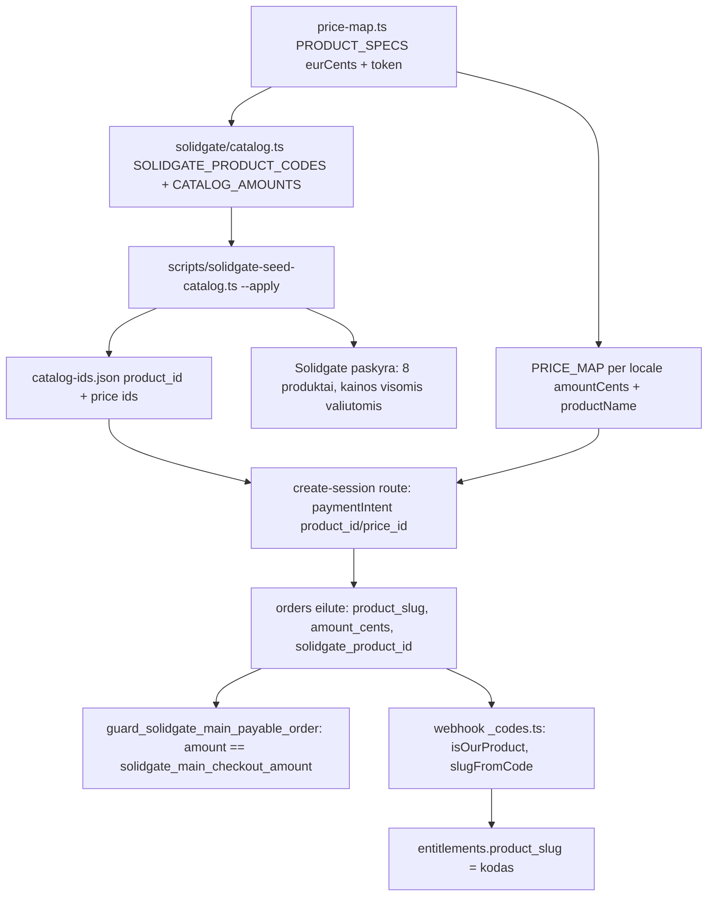

# Produktų katalogas ir produktų kodai: kur jie gyvena ir kaip susiję

> Šis detalus aprašymas fiksuoja būseną iki 2026-09-14 audito pataisų. Naujas pinigų žurnalas, auth / kortelės patvirtinimo apsaugos ir pakeisti srautai aprašyti [pataisų dokumente](../FIXES_2026-09-14.lt.md).

Šis dokumentas aprašo, kaip dabartinis boilerplate apibrėžia produktus, kainas
ir produktų kodus, per kokias vietas kodas keliauja nuo `price-map.ts` iki
Solidgate paskyros, DB apsaugų ir webhook'o. Jis yra pagrindas būsimai
„žingsnis po žingsnio“ instrukcijai; čia fiksuojama tik esama sistema.

Kodas ir failai aprašyti tokie, kokie yra `main` šakoje 2026-09-11. Visos
kainos boilerplate yra **demonstracinės** (`BRAND*_000000_*`, EUR bazė su
apvaliais kursais) ir neskirtos paleisti.

## Produktų kodo gramatika

Kiekvienas parduodamas dalykas turi **pasiūlymo kodą** (offering code). Jis
generuojamas, ne rašomas ranka:

```
{LOCALE_PREFIX}_{PRODUCT_CODE_PREFIX}{TOKEN}_{PRICE_BATCH}_{SUB|PDF}
```

| Segmentas | Iš kur | Boilerplate reikšmė | Pavyzdys realiame produkte |
|---|---|---|---|
| `LOCALE_PREFIX` | [`LOCALE_COMPANY_PREFIXES`](../../../packages/shared/src/locale-prefixes.ts#L13) pagal locale (`lt → LT`, `cs → CZ`, `ja → JP` ir t. t.) | `EN`, `LT`, … | `LT` |
| `PRODUCT_CODE_PREFIX` | [`price-map.ts`](../../../packages/shared/src/price-map.ts#L61) | `BRAND` | `PRODUCTCODE` |
| `TOKEN` | [`PRODUCT_SPECS[].token`](../../../packages/shared/src/price-map.ts#L139): `''` pagrindinei prenumeratai, `LIFETIME`, `ADDON`, `BUNDLE`, `BUNDLE1..3`, `PDF4..7` | `LIFETIME` | `LIFETIME` |
| `PRICE_BATCH` | [`price-map.ts`](../../../packages/shared/src/price-map.ts#L69) — kainų partijos data `YYMMDD` | `000000` | `260424` |
| `SUB` / `PDF` | [`PRODUCT_SPECS[].kind`](../../../packages/shared/src/price-map.ts#L132): prenumerata arba vienkartinis skaitmeninis produktas | `SUB` | `SUB` |

Todėl `LT_PRODUCTCODE_260424_SUB` yra: lietuviška locale, prekės ženklo
prefiksas `PRODUCTCODE`, tuščias token (pagrindinė prenumerata), partija
`260424`, prenumerata. Tas pats produktas OTO lygmeniu būtų
`LT_PRODUCTCODELIFETIME_260424_SUB`, o vienkartinis PDF —
`LT_PRODUCTCODEPDF4_260424_PDF`.

Kodas egzistuoja **dviem formomis**, ir abi turi būti atpažįstamos visada:

- **su locale prefiksu** (`LT_BRANDPDF5_000000_PDF`) — rašoma į `orders.product_name`
  ir naudojama per-pirkėjo artefaktams: užsakymo aprašui
  ([`solidgateOrderDescription`](../../../packages/shared/src/locale-prefixes.ts#L42)),
  CRM žymoms, eksportams;
- **be prefikso** (`BRANDPDF5_000000_PDF`) — Solidgate katalogo produkto kodas,
  rašomas į `orders.product_slug`, `order_metadata.product_code` ir
  `entitlements.product_slug`. Katalogas yra locale-agnostiškas: vienas
  produktas, kainos visomis valiutomis.

Abu skaitytojai ([`productToken`](../../../supabase/functions/solidgate-webhooks/_codes.ts#L59)
webhook'e ir [`productKeyFromSlug`](../../../packages/shared/src/oto-product-label.ts#L74)
aplikacijoje) tikrina ir `parts[0]`, ir `parts[1]`, todėl abi formos
atsiskleidžia į tą patį token. Komentaruose užfiksuotas incidentas: kai buvo
skaitomas tik `parts[1]`, visi bare kodai virto `unknown`, o OTO-8 suvestinė ir
admin skaidymas rodė tuščius laukus.

### Vidiniai slug'ai vs kodai

Kodas yra tai, ką mato Solidgate ir DB. Aplikacija viduje operuoja **vidiniais
slug'ais** (`trial1`, `special_free`, `oto1_lifetime`, `oto3_bundle_2`, …).
Ryšys:

| Vidinis slug (`ProductId`) | Token | Kodas (be prefikso) | Rūšis |
|---|---|---|---|
| `trial1`, `trial2`, `trial3`, `trial4`, `special_1eur`, `special_free`, `trial_monthly` | `''` | `BRAND_000000_SUB` | Pagrindinė prenumerata: 4 intro lygiai + 2 special variantai + rebill kaina. Vienas kodas visiems. |
| `oto1_lifetime` | `LIFETIME` | `BRANDLIFETIME_000000_SUB` | OTO 1, „lifetime“ (vienkartinis mokėjimas, bet `SUB` sufiksas — istorinis; pirkimas atšaukia pagrindinę prenumeratą, žr. [`isLifetime`](../../../supabase/functions/solidgate-webhooks/_codes.ts#L124)) |
| `oto2_addon_weekly` | `ADDON` | `BRANDADDON_000000_SUB` | OTO 2, savaitinis pasikartojantis priedas (antra prenumerata) |
| `oto3_bundle_all`, `oto3_bundle_1..3` | `BUNDLE`, `BUNDLE1..3` | `BRANDBUNDLE*_000000_PDF` | OTO 3, vienas iš keturių variantų |
| `oto4_pdf` … `oto7_pdf` | `PDF4..7` | `BRANDPDF4..7_000000_PDF` | OTO 4–7, vienkartiniai |

Trys skirtingi žodynai laiko tą patį sąrašą ir turi sutapti:
[`PRICE_MAP` raktai](../../../packages/shared/src/price-map.ts#L139),
[`CODE_TO_SLUG`](../../../supabase/functions/solidgate-webhooks/_codes.ts#L20) webhook'e ir
[`INTERNAL_ID_TO_KEY` / `CODE_TOKEN_TO_KEY`](../../../packages/shared/src/oto-product-label.ts#L32)
rodinių raktams. Ketvirtas žodynas — SQL (žr. žemiau).

## Kur kodas ir kaina keliauja: grandinė



Skaitant iš viršaus:

1. **Vienintelė produkto deklaracija** yra
   [`PRODUCT_SPECS`](../../../packages/shared/src/price-map.ts#L139): token,
   rūšis, EUR bazinė suma ir marketingo „buvo“ kaina. Iš jos
   [`buildPriceMap()`](../../../packages/shared/src/price-map.ts#L177) sugeneruoja
   `PRICE_MAP[productId][locale] = { amountCents, productName, compareAtCents? }`
   kiekvienai iš 15 locale, naudodama
   [`LOCALE_CURRENCY_MAP`](../../../packages/shared/src/price-map.ts#L73) (locale → valiuta)
   ir [`CURRENCY_DEMO_FACTORS`](../../../packages/shared/src/price-map.ts#L113)
   (demo kursai). `EN` moka USD, bet 1:1 su EUR sumomis. JPY yra nulinės
   dešimtainės dalies valiuta: jos „minor units“ yra jenos, koeficientas 2,
   niekada nedauginti iš 100.
2. [`resolveProductPrice(productId, locale)`](../../../packages/shared/src/price-map.ts#L214)
   yra tai, ką serveris kviečia, kad gautų sumą, valiutą ir kodą. Naršyklė
   sumos neįtakoja.
3. [`solidgate/catalog.ts`](../../../packages/shared/src/solidgate/catalog.ts) laiko
   **Solidgate katalogą**: [`SOLIDGATE_PRODUCT_CODES`](../../../packages/shared/src/solidgate/catalog.ts#L32)
   (kodai be locale prefikso), [`PRODUCT_ID_TO_CODE`](../../../packages/shared/src/solidgate/catalog.ts#L47)
   (slug → kodas), [`CATALOG_AMOUNTS`](../../../packages/shared/src/solidgate/catalog.ts#L91)
   (sumos per valiutą, **literalai**, ne išvestiniai iš `PRICE_MAP` — testas
   [`solidgate-catalog.test.ts`](../../../packages/shared/src/__tests__/solidgate-catalog.test.ts)
   pina sutapimą, ir būtent todėl lentelė laikoma literalu: išvestinė padarytų
   testą tautologišku) ir [`SOLIDGATE_PRODUCTS`](../../../packages/shared/src/solidgate/catalog.ts#L357)
   — 8 produktai, kuriuos reikia sukurti Solidgate paskyroje.
4. **Tik prenumeratoms reikia katalogo produkto.** Solidgate produkte laiko
   billing periodą, trial periodą ir kainą. Todėl 6 pagrindinės prenumeratos
   intro lygiai yra 6 atskiri Solidgate produktai su tuo pačiu kodu
   `BRAND_000000_SUB`, besiskiriantys tik `trial_price`. Vienkartiniai OTO
   ([`ONE_TIME_PRODUCT_IDS`](../../../packages/shared/src/solidgate/catalog.ts#L412))
   katalogo produkto neturi: jie apmokestinami per `POST /recurring` su suma ir
   valiuta iš `PRICE_MAP`.
5. [`scripts/solidgate-seed-catalog.ts`](../../../scripts/solidgate-seed-catalog.ts)
   sukuria arba suranda (pagal `metadata.catalog_key`) produktus paskyroje ir
   įrašo jų ID į [`catalog-ids.json`](../../../packages/shared/src/solidgate/catalog-ids.json).
   Failas turi 8 raktus (`trial1..trial4`, `special_1eur`, `special_free`,
   `addon_trial`, `addon_direct`), kiekvienas su `product_id` ir `prices` per 10
   valiutų. Boilerplate visi 88 ID yra tušti, ir
   [testas](../../../packages/shared/src/__tests__/solidgate-catalog.test.ts#L190)
   reikalauja, kad taip ir liktų. Realiame projekte failas commit'inamas.
6. [`create-session`](../../../apps/funnel/src/app/api/solidgate/create-session/route.ts#L438)
   skaito `catalog-ids.json`, paima `product_id` ir kainos ID pagal valiutą ir
   įdeda juos į šifruotą `paymentIntent`. Tas pats ID įrašomas į
   `orders.solidgate_product_id` kaip nekintamo tapatybės snapshot dalis.
7. DB gauna `product_slug`, `amount_cents`, `currency`. Trigger'is
   `guard_solidgate_main_payable_order()` sulygina sumą su
   [`solidgate_main_checkout_amount(slug, currency)`](../../../supabase/migrations/00001_baseline.sql#L186).
   Nesutapimas — `SQLSTATE 23514`, checkout krenta. Tai serverio kainos autoritetas.
8. Webhook'as gauna įvykius su `order.product_id`, `order_metadata.product_code`
   ir pan. [`_codes.ts`](../../../supabase/functions/solidgate-webhooks/_codes.ts)
   atsako į klausimą „ar tai mūsų produktas“ (`isOurProduct`, brand guard —
   svetimo prekės ženklo įvykis toje pačioje paskyroje patvirtinamas 200 ir
   ignoruojamas), verčia kodą į slug (`slugFromCode`) ir sprendžia produkto
   tipą (`isMainSubscription`, `isRecurringAddon`, `isLifetime`).
9. Teisės (`entitlements.product_slug`) saugo **kodą**, ne slug. RPC
   [`grant_solidgate_main_entitlement`](../../../supabase/migrations/00001_baseline.sql#L6386)
   pina jį literalu `'BRAND_000000_SUB'`.

## Keturios (iš tikrųjų daugiau) vietos, kurios turi keistis kartu

`CLAUDE.md` 3 taisyklė sako, kad katalogas užkoduotas keturiose vietose. Tai
teisinga kaip minimumas, bet SQL dalis platesnė, negu sako komentaras
„section 2 is the ONLY place the schema knows anything about your offers“.
Faktinis inventorius `main` šakoje:

| Vieta | Kas ten yra | Kiek literalų |
|---|---|---|
| [`price-map.ts`](../../../packages/shared/src/price-map.ts) | `PRODUCT_CODE_PREFIX`, `PRICE_BATCH`, `PRODUCT_SPECS`, kursai | 2 konstantos, 17 spec'ų |
| [`solidgate/catalog.ts`](../../../packages/shared/src/solidgate/catalog.ts) | kodai išvedami iš tų pačių konstantų; `CATALOG_AMOUNTS` ir `SOLIDGATE_PRODUCTS` literalai | 17 × 10 sumų |
| [`oto-product-label.ts`](../../../packages/shared/src/oto-product-label.ts) | `CODE_TOKEN_TO_KEY` su `BRAND*` token'ais, `ProductKey` sąjunga (kontraktas su `success.json`) | 11 token'ų |
| [`_codes.ts`](../../../supabase/functions/solidgate-webhooks/_codes.ts) | `CODE_TO_SLUG` su `BRAND*` token'ais, `PRODUCT_DISPLAY_NAMES`, `productTokenFromSlug` (`'BRAND'` literalas) | 11 token'ų + 1 |
| [`00001_baseline.sql` § 2](../../../supabase/migrations/00001_baseline.sql#L45) | 5 IMMUTABLE resolveriai: `solidgate_oto_step_from_product_slug`, `_from_internal_slug`, `solidgate_persisted_oto_step`, `solidgate_pwa_product_code`, `solidgate_main_checkout_amount` | ~25 kodų + kainų tinklelis |
| `00001_baseline.sql` **už § 2 ribų** | `'BRAND_000000_SUB'` ir `funnel_code = 'BRAND'` literalai trigger'iuose ir RPC: [`solidgate_main_checkout_states` CHECK](../../../supabase/migrations/00001_baseline.sql#L1131), [`guard_solidgate_main_payable_order`](../../../supabase/migrations/00001_baseline.sql#L1458), [`guard_solidgate_oto_payable_order`](../../../supabase/migrations/00001_baseline.sql#L1654), [`prevent_solidgate_entitlement_replay`](../../../supabase/migrations/00001_baseline.sql#L2260), [`reconcile_solidgate_legacy_order_identity`](../../../supabase/migrations/00001_baseline.sql#L2863) (pilna slug → kodas lentelė dar kartą), [`open_solidgate_main_checkout_v2`](../../../supabase/migrations/00001_baseline.sql#L3134), [`grant_solidgate_main_entitlement`](../../../supabase/migrations/00001_baseline.sql#L6386) ir kt. | 59 eilutės |
| [`webhook index.ts`](../../../supabase/functions/solidgate-webhooks/index.ts#L233) | `INITIAL_SUBSCRIPTION_PRODUCT_IDS` — Solidgate produkto ID atpažinimo aibė (tuščia boilerplate; pildoma po seed) | 8 raktai |
| [`checkout-context.ts`](../../../apps/funnel/src/features/analytics/lib/checkout-context.ts#L25) | `FUNNEL_CODE = PRODUCT_CODE_PREFIX` — rašoma į `tracking_metadata.funnel_code`; DB trigger'iai tą pačią reikšmę tikrina literalu `'BRAND'` | išvestinė |
| [`pwa-products.ts`](../../../apps/pwa/src/lib/pwa-products.ts) | ką narių zona gali parduoti; `PRODUCT_CODE_PATTERN` išvedamas iš konstantų | išvestinė |
| [`success.json`](../../../packages/i18n/messages/en/success.json) | `products.*` / `orderProducts.*` pagal `ProductKey` | 11 raktų |
| `supabase/tests/*.sql` | fixture'ai su `BRAND*_000000_*` | daug |

Praktinė išvada, kurią fiksuos „žingsnis po žingsnio“ dokumentas: **prefikso
ir partijos keitimas TypeScript pusėje yra dvi konstantos; SQL pusėje tai viso
failo `BRAND` → `PRODUCTCODE` ir `000000` → `260424` pakeitimas**, po kurio
privaloma paleisti [`sql-price-grid-parity.test.ts`](../../../packages/shared/src/__tests__/sql-price-grid-parity.test.ts)
ir visus `supabase/tests/*.sql`. Parity testas parsina SQL funkciją ir lygina su
`PRICE_MAP`; jis atsirado po realaus DKK/JPY drifto, kuris būtų nuvertęs visus
ne-EUR checkout'us, kol kiti testai žali.

Ką dar reikia pakeisti, kai keičiasi **kainos** (ne kodai): `PRODUCT_SPECS.eurCents`
ir `CURRENCY_DEMO_FACTORS` (arba pilnas rankinis `PRICE_MAP`), `CATALOG_AMOUNTS`,
`ADDON_TRIAL_INTRO_AMOUNTS`, SQL `solidgate_main_checkout_amount` tinklelis, ir
tada `--apply` seed, nes Solidgate kainos yra paskyroje. Pakeitus jau
parduodamo produkto kainą Solidgate pusėje, senos prenumeratos lieka su sena
kaina, todėl kodo partija (`PRICE_BATCH`) yra kodo dalis: naujas tinklelis —
nauja partija, seni kodai lieka atpažįstami.

## Kaip tai padaryta theastrologist projekte (palyginimui)

Šaltinio projektas `/Users/Netas/Projects/theastrologist` naudoja tą pačią
gramatiką, bet su realiais pavadinimais ir viena struktūrine yda, kurią
boilerplate pataisė:

- Prefiksas `THEASTRL`, token'ai `ADVISORY`, `LIFETIME`, `ULTRAPACK`,
  `SOULREPORT`, `LOVEREPORT`, `ENERGYGUIDE`, `PALMISTRY`, `TAROT`, `NUMEROLOGY`;
  locale prefiksai tie patys (`LT_`, `CZ_`, `JP_`, …), plius antra locale banga.
- `price-map.ts` ten laiko **ranka surašytą** `PRICE_MAP` su 32 locale × 17
  produktų literalais (`productName: "LT_THEASTRL_260513_SUB"`), t. y. ~500
  eilučių, kurios gali išsiskirti. Boilerplate tai pakeitė generavimu iš
  `PRODUCT_SPECS`.
- Ten yra **dvi partijos**: `260513` price-map'e (Stripe eros kodai) ir
  `SOLIDGATE_BATCH = '260523'` kataloge. Jos skiriasi, ir webhook `_codes.ts`
  komentaras aiškina, kad abi formos turi būti atpažįstamos. Boilerplate turi
  vieną `PRICE_BATCH`, kurį `catalog.ts` importuoja (`SOLIDGATE_BATCH = PRICE_BATCH`);
  `CLAUDE.md` draudžia grąžinti antrą konstantą.
- Produktų kodai ten įrašyti į `catalog.ts` `SOLIDGATE_PRODUCT_CODES` template
  literalais (`THEASTRL_${SOLIDGATE_BATCH}_SUB`), o boilerplate — per
  `${PRODUCT_CODE_PREFIX}${TOKEN}_${SOLIDGATE_BATCH}_${KIND}`.

Šio palyginimo tikslas — parodyti, kad `LT_PRODUCTCODE_260424_SUB` stiliaus
kodas boilerplate gaunamas nustačius **dvi konstantas** (`PRODUCT_CODE_PREFIX`,
`PRICE_BATCH`) ir peržiūrėjus token'us, o ne perrašant 500 literalų. Realių
theastrologist kainų, ID ar pavadinimų į boilerplate perkelti nereikia ir
negalima (`CLAUDE.md`).

## Solidgate paskyros pusė

Kas turi egzistuoti paskyroje, kad checkout veiktų:

| Solidgate objektas | Iš kur | Pastaba |
|---|---|---|
| 8 produktai (`SOLIDGATE_PRODUCTS`) su `metadata.catalog_key` | seed skriptas | `catalog_key` yra idempotencijos raktas: pakartotinis `--apply` produktų nedubliuoja |
| Po 10 kainų kiekvienam produktui (`CATALOG_CURRENCIES`) | seed skriptas | Solidgate upsert'ina kainą pagal (produktas, valiuta) |
| Trial nustatymai: 7 dienos, `auth_settle` (mokamas intro) arba `auth_0_amount` (`special_free`) | `SOLIDGATE_PRODUCTS[].trial` | Kai kurie įgijėjai atmeta nulinę autorizaciją (kodas 5.04); tada `special_free` daromas mokamas |
| Billing periodas: 30 dienų pagrindinei, 1 savaitė priedui | `EVERY_30_DAYS`, `WEEKLY` | Copy visose locale žada „kas 30 dienų“; katalogas turi atitikti copy |
| Webhook prenumeratos ir raktų poros (`api_*`, `wh_*`) sandbox ir live kanalams | `.env.example` | Sandbox ir live yra atskiri kanalai, nėra „test mode“ vėliavos |

`--verify` režimas perskaito produktus ir kainas ir lygina sumas, valiutas bei
ID; billing / trial periodo ir `payment_action` jis **netikrina**
([peržiūros 9 radinys](../BOILERPLATE_REVIEW.lt.md)).

## Ką reiškia „vienas kodas, keli produktai“

Dažniausia painiava: `BRAND_000000_SUB` yra **vienas pasiūlymo kodas**, bet
Solidgate paskyroje jam atitinka **šeši produktai** (`trial1..4`,
`special_1eur`, `special_free`), nes intro kaina Solidgate modelyje yra
produkto savybė (`trial_price`), ne kainos. Kai webhook'as gauna prenumeratos
įvykį, jis atpažįsta produktą pagal `product_id` (`INITIAL_SUBSCRIPTION_PRODUCT_IDS`)
arba pagal kodą (`isOurProduct`), o vidinį lygį (`trial3`) — iš
`order_metadata.tier` / `product_slug`, kurį įrašė `create-session`.

Panašiai `BRANDADDON_000000_SUB` turi du produktus: `addon_trial` (funnel OTO2
su 7 dienų mokamu trial) ir `addon_direct` (PWA paywall, be trial). Skirtumą
Solidgate išreiškia tik atskiru produktu.

## Susiję dokumentai

- [Kainų ir katalogo paaiškinimas iš pirminio audito](../price-map-and-catalog.lt.md) —
  šaltinio projekto kontekstas, ne šio repo konfigūracija.
- [Lentelės `orders` ir `entitlements`](02-lenteles-orders-entitlements.lt.md) —
  kur kodas nusėda DB.
- [DB funkcijos](07-funkcijos-rpc-triggeriai.lt.md) — § 2 resolveriai ir
  kainos autoritetas.
